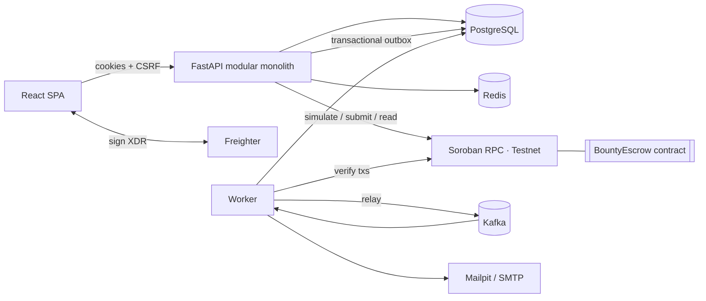

# BountyFlow

**Work gets done. Rewards move transparently.**

BountyFlow is a full-stack bounty marketplace on **Stellar**. Requesters post funded bounties, contributors apply
and deliver work, and rewards settle through a **Soroban escrow contract**. Every funding, payout and refund is
verified on-chain before the app records it.

> Live on **Stellar Testnet**. Escrow contract
> [`CDX6FN2M…4SFY4CY`](https://stellar.expert/explorer/testnet/contract/CDX6FN2MIGLHCMUJOU6C7FYP3QTNDL6BVIPEG4B5HAUEPU7NI4SFY4CY).
> The full lifecycle has been exercised on-chain: escrow funding
> [`3e898e06…22a8`](https://stellar.expert/explorer/testnet/tx/3e898e0604ae024451cc8d751486f15377d2f1ff1575c8e8e708d103125e22a8)
> and payout
> [`7774ab36…5765`](https://stellar.expert/explorer/testnet/tx/7774ab3611874aeeb21eb09be609932d7664474b9a151718e6ea3e8e2cb75765).

---

## Contents

[Problem & solution](#problem--solution) · [Features](#key-features) · [Screenshots](#screenshots) ·
[Architecture](#architecture) · [Tech stack](#technology-stack) · [Repository](#repository-structure) ·
[Quick start](#quick-start) · [Configuration](#environment-configuration) · [Database](#database-migrations--seed-data) ·
[Commands](#makefile-commands) · [API](#api) · [Kafka](#kafka-architecture) · [Caching](#redis-caching-strategy) ·
[Stellar](#stellar-testnet--wallets) · [Contract](#soroban-contract) · [Testing](#testing) ·
[Security](#security) · [Limitations](#known-limitations) · [Roadmap](#roadmap) · [Contributing](#contributing)

## Problem & solution

**Problem.** Paying for small, well-defined work across the internet is built on trust. Contributors worry they
won't be paid after delivering. Requesters worry about paying for work that doesn't meet the brief. Payment
records are opaque, and "funded" labels usually mean nothing.

**Solution.** BountyFlow puts each bounty's reward into a Soroban escrow *before* anyone starts work. It tracks the
work through an explicit, auditable state machine. Only verified on-chain events move money-related state:
- A bounty is **Funded** only when the contract says so.
- A payment is **Confirmed** only when the contract reports the contributor as paid.
- A refund cannot bypass the contract's rules.

## Key features

- **Marketplace:** full-text search, filters (category, skills, reward, difficulty, deadline, status, funded
  only), sorting (newest, deadline, reward, documented popularity), pagination, bookmarks, reports.
- **Complete lifecycle:** draft → publish → fund escrow → apply → select → submit → revise → approve → on-chain
  payout, plus cancellation and refunds. Multi-position bounties and partial funding are supported.
- **Real Stellar integration:**
  - Freighter wallet, with SEP-10 ownership proofs.
  - Contract calls are built and preflighted on the server (Soroban RPC simulation) and signed in the wallet.
  - The server verifies the signed envelope, submits it, confirms the result, and reconciles from chain state.
- **Soroban escrow contract** in Rust: access control, checked arithmetic, duplicate-payout prevention, refund
  conditions, and disputes with a bounded arbiter. There is no admin withdrawal.
- **Disputes:** evidence, moderator review, and on-chain freeze and resolution.
- **Notifications:** in-app and email (HTML templates), delivered asynchronously through Kafka with exactly-once
  email sending.
- **Dashboard:** requester and contributor views, an activity feed, and deterministic skill-based
  recommendations.
- **Analytics:** a documented methodology for every metric. Suspended accounts and moderator-hidden bounties are
  excluded, and every on-chain metric counts verified transactions only.
- **Administration:** RBAC (`USER` / `MODERATOR` / `ADMIN`) with a central permission matrix, user and bounty
  moderation, reports, a dispute queue, transaction monitoring, and an immutable audit log.
- **Security:** Argon2id, HttpOnly cookie sessions with refresh rotation and reuse detection, CSRF double-submit,
  rate limits, strict validation, safe markdown, security headers, and redacted structured logs (Logifyx).
- **Motion and UI:** light-first design system with a dark theme (shadcn/ui + Tailwind v4 tokens). GSAP drives the
  motion: the hero's floor of real open rewards that you can pick up and throw (Draggable, Inertia),
  a draggable bounty rail, a pinned story that hands a bounty from the requester's steps to the contributor's, the
  escrow state machine drawing itself while pinned (DrawSVG) with hover explanations, split-text
  headings, an animated light/dark switch and coin bursts when escrow is funded or paid out. ScrollSmoother and Lenis handle smooth scrolling, and boneyard
  skeletons are captured from the real layout. Everything respects reduced motion; WCAG-minded and responsive from
  360 px up.

## Screenshots

| Landing | Marketplace | Bounty detail |
|---|---|---|
|  |  |  |

| Dashboard | Chain action (sign & verify) | Mobile |
|---|---|---|
|  |  |  |

## Architecture



Details, sequence diagrams and design decisions: [docs/architecture.md](docs/architecture.md).

## Technology stack

| Layer | Technologies |
|---|---|
| Frontend | React 19, TypeScript (strict), Vite, React Router 7, Tailwind CSS v4, shadcn/ui (Radix), lucide-react, GSAP (ScrollTrigger, ScrollSmoother, SplitText, Draggable, Inertia, Physics2D, DrawSVG, ScrambleText, Flip), Lenis, boneyard-js, TanStack Query, Zustand, React Hook Form + Zod, Recharts, Vitest, Testing Library, Playwright |
| Backend | Python 3.12, FastAPI, Uvicorn, Pydantic v2, pydantic-settings, SQLAlchemy 2.1 (async), Alembic, psycopg 3, redis-py, aiokafka, stellar-sdk (Soroban RPC), httpx, **Logifyx** logging, argon2-cffi, PyJWT, Jinja2, pytest, Ruff, mypy, **uv** |
| Data | PostgreSQL 17, Redis 7.4, Apache Kafka 3.9 (KRaft) |
| Blockchain | Stellar Testnet, Soroban (Rust, soroban-sdk 28), Stellar CLI 27, Stellar Asset Contract (native XLM), Freighter |
| Ops | Docker, Docker Compose, Make, GitHub Actions, Mailpit, Kafka UI |

## Repository structure

```
.
├── backend/                 FastAPI API + worker (uv project)
│   ├── app/
│   │   ├── core/            config, security, RBAC, logging, middleware, rate limits, money
│   │   ├── db/ cache/       SQLAlchemy base/session, Redis cache keys & invalidation
│   │   ├── messaging/       event envelope, payload schemas, outbox, Kafka, consumer registry
│   │   ├── blockchain/      network config, SEP-10 wallet proof, adapters, verification, reconciliation
│   │   ├── modules/         auth · users · bounties · applications · submissions · payments ·
│   │   │                    disputes · notifications · analytics · admin · dashboard
│   │   ├── api/             router + health/config endpoints
│   │   ├── scripts/seed.py  idempotent seed: accounts, profiles, bounties
│   │   └── templates/email/ HTML + text email templates
│   ├── worker/              Kafka consumers, outbox relay, periodic jobs, retry/DLQ
│   ├── migrations/          Alembic
│   └── tests/               unit · integration (API, security, bugs) · contract (Testnet E2E)
├── contracts/bounty_escrow/ Soroban escrow contract (Rust) + deployments/testnet.json
├── frontend/                React app (pages, components, API client, Stellar integration, e2e/)
├── infra/                   Postgres init, Kafka topic bootstrap
├── docs/                    architecture, api, database, blockchain, smart-contracts, security, …
├── scripts/                 contract deploy scripts (bash + PowerShell)
├── docker-compose.yml  Makefile  .env.example
```

## Quick start

Prerequisites: Docker, GNU Make + bash (Git Bash on Windows), [uv](https://docs.astral.sh/uv/),
Node 22 + pnpm. Rust and the Stellar CLI are needed only for contract work.

```bash
make install     # .env with a fresh JWT secret, backend + frontend dependencies
make dev         # Postgres/Redis/Kafka/Mailpit in Docker; migrate + seed; API, worker, Vite
```

Open http://localhost:5173/login and sign in with one of the [seeded accounts](#database-migrations--seed-data), or
register your own. Alternatively, run everything in containers with `make up` → http://localhost:3000.

| Service | URL |
|---|---|
| App | http://localhost:5173 (dev) · http://localhost:3000 (Docker) |
| API docs (OpenAPI) | http://localhost:8000/api/docs |
| Mailpit | http://localhost:8025 |
| Kafka UI | http://localhost:8080 (`make up-tools`) |

## Environment configuration

Everything is documented in [`.env.example`](.env.example). Settings are validated at startup, and production
refuses weak secrets and insecure cookies.

| Variable | Purpose |
|---|---|
| `BLOCKCHAIN_MODE` | `testnet` (default) · `mainnet` (separate, audited future deployment) |
| `SOROBAN_CONTRACT_ID`, `STELLAR_NATIVE_ASSET_CONTRACT_ID`, `STELLAR_ARBITER_ADDRESS` | Deployed escrow, native XLM SAC, dispute arbiter |
| `STELLAR_NETWORK_PASSPHRASE`, `STELLAR_HORIZON_URL`, `STELLAR_SOROBAN_RPC_URL`, `STELLAR_EXPLORER_BASE_URL` | Explicit network configuration |
| `RUN_MIGRATIONS_ON_STARTUP` | API applies migrations on boot (advisory-locked) |
| `SEED_ON_STARTUP` | API runs the **idempotent** seed on every boot (skipped in staging/production) |
| `SEED_USER_PASSWORD` | Password given to the seeded accounts (development only) |
| `DATABASE_URL`, `REDIS_URL`, `KAFKA_BOOTSTRAP_SERVERS` | Data stores |
| `JWT_SECRET`, `ACCESS_TOKEN_TTL`, `REFRESH_TOKEN_TTL`, `COOKIE_SECURE`, `COOKIE_SAMESITE` | Sessions |
| `SMTP_*`, `EMAIL_FROM` | Email (Mailpit locally) |
| `LOG_LEVEL`, `LOG_JSON`, `LOG_OUTPUT` | Logifyx logging |

## Database migrations & seed data

```bash
make migrate                       # alembic upgrade head
make migration m="describe change" # autogenerate a revision
make seed                          # idempotent: creates only missing accounts and bounties
make reset-db                      # DESTRUCTIVE (asks for confirmation)
```

The seed creates regular accounts with full profiles, plus bounties across every category, applications and
notifications. They are ordinary accounts and bounties: nothing is flagged or treated differently from data
created through the app. The seed never fabricates chain activity. Funding and payouts only happen when a real
wallet signs them. See [docs/database.md](docs/database.md).

Seeded accounts (sign in at `/login`):

| Email | Role | What the account has |
|---|---|---|
| `ada.okafor@bountyflow.test` | User | Posts bounties (requester) |
| `nova.labs@bountyflow.test` | User | Posts bounties (requester) |
| `kai.tanaka@bountyflow.test` | User | Applies to bounties (contributor) |
| `river.chen@bountyflow.test` | User | Contributor |
| `mira.kovac@bountyflow.test` | User | Contributor |
| `sol.adeyemi@bountyflow.test` | User | Contributor |
| `priya.nair@bountyflow.test` | Moderator | Moderation queue, disputes |
| `morgan.reyes@bountyflow.test` | Admin | Admin console, users, roles, audit log |

Every account uses the password in `SEED_USER_PASSWORD` (default `BountyFlow!2026`). `make seed` prints this list.

## Makefile commands

```
make help            make install         make dev             make up / down / restart / logs
make build           make test            make test-api        make test-frontend      make test-e2e
make test-testnet    make lint            make format          make typecheck          make migrate
make migration       make seed            make reset-db        make worker             make api
make contract-build  make contract-test   make contract-deploy-testnet                 make audit  make clean
```

## API

REST under `/api/v1`, with interactive OpenAPI at `/api/docs`. The contract is in [docs/api.md](docs/api.md):
cookie auth plus CSRF, a consistent error envelope, pagination and typed shapes. Health checks are at `/health`,
`/health/live` and `/health/ready`.

## Kafka architecture

State changes and their events commit together through a **transactional outbox**. The worker relays them to
Kafka topics (`bounty`, `application`, `submission`, `payment`, `notification`, `analytics`, `blockchain`,
`email` `.events`). Consumer groups provide idempotent handlers, bounded exponential retries and dead-letter
topics. See [docs/kafka-events.md](docs/kafka-events.md).

## Redis caching strategy

| Data | TTL | Invalidation |
|---|---|---|
| Marketplace queries, featured | 45–60 s | Generation counter bumped on any bounty change (O(1)) |
| Bounty detail (viewer-independent part) | 45 s | On update, publish, funding, acceptance, approval, payment |
| Public profile + stats | 120 s | On profile, wallet, assignment and payment changes |
| Public analytics | 60 s | On confirmed transactions |
| Rate limits, SEP-10 challenges, tx locks, view de-duplication | seconds–1 day | Expiry |

PostgreSQL stays the source of truth. Cache failures are logged and bypassed.

## Stellar Testnet & wallets

1. Install [Freighter](https://www.freighter.app/) and switch it to **Testnet**.
2. Fund your address with Friendbot: `https://friendbot.stellar.org/?addr=G...`.
3. In BountyFlow, go to **Profile → Wallets → Connect**, then sign the ownership challenge. It's free and never
   submitted.
4. Fund a bounty and approve the escrow transaction in Freighter. It is verified on-chain and linked to
   StellarExpert.

More in [docs/blockchain.md](docs/blockchain.md).

## Soroban contract

`contracts/bounty_escrow` provides `create_escrow`, `fund`, `assign`, `release`, `request_cancel`,
`consent_cancel`, `refund`, `raise_dispute`, `resolve_dispute`, and the views `get_escrow` and `assignment`. It has
33 unit tests.

```bash
make contract-test
make contract-build
make contract-deploy-testnet   # needs Stellar CLI; writes contracts/deployments/testnet.json
```

Trust assumptions and limitations: [docs/smart-contracts.md](docs/smart-contracts.md) and
[contracts/README.md](contracts/README.md).

## Testing

| Suite | Command |
|---|---|
| Backend unit + integration (isolated test DB, fakeredis, signed-XDR test chain) | `make test-api` |
| Real Stellar Testnet lifecycle (opt-in) | `make test-testnet` |
| Contract | `make contract-test` |
| Frontend unit | `make test-frontend` |
| Playwright E2E (desktop, tablet, mobile) | `make test-e2e` |

See [docs/testing.md](docs/testing.md).

## Troubleshooting

| Symptom | Fix |
|---|---|
| `Psycopg cannot use the 'ProactorEventLoop'` (Windows) | Start the API with `make api` / `python -m app.serve` |
| "On-chain escrow is not configured" | Set `SOROBAN_CONTRACT_ID` and `STELLAR_NATIVE_ASSET_CONTRACT_ID` (see `.env.example`) |
| `account_not_found` when funding | Fund the wallet with Friendbot |
| `email_not_verified` when publishing | Open the verification email in Mailpit |
| Kafka unreachable from the host | Use `localhost:9094` (external listener) |

More in [docs/development.md](docs/development.md).

## Security

A threat model, RBAC matrix, session and CSRF design, transaction verification and contract trust assumptions are
documented in [docs/security.md](docs/security.md). BountyFlow never asks for, receives or stores seed phrases or
private keys.

## Known limitations

- A payout needs the requester's wallet signature, so the contract cannot force a release. Disputes let a bounded
  arbiter route **frozen** escrows.
- There is a single arbiter key on Testnet (use multisig for mainnet). Only native XLM is supported for now.
- Profiles and skills are self-reported. Only wallet ownership is cryptographically verified.

## Roadmap

Stellar Wallets Kit (multi-wallet), USDC and SAC tokens, milestone escrows, auto-release after a review timeout,
on-chain reputation attestations, GitHub PR verification, and fee sponsorship. See
[docs/product-roadmap.md](docs/product-roadmap.md).

## Contributing

1. `make install && make dev`
2. Keep `make check` green (lint, types, tests). Add tests with every change.
3. Database changes need an Alembic migration (`make migration m="..."`). API changes must update
   `docs/api.md`.
4. Never commit secrets. `.env` is ignored and the placeholders in `.env.example` are rejected in production.

## License

MIT. Built for the Stellar ecosystem.
