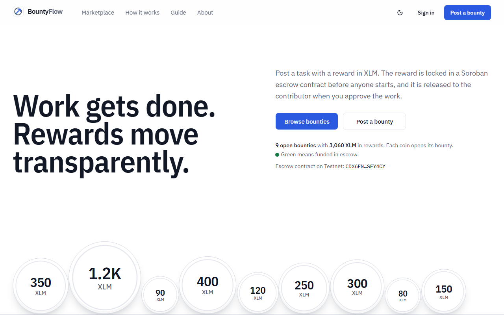
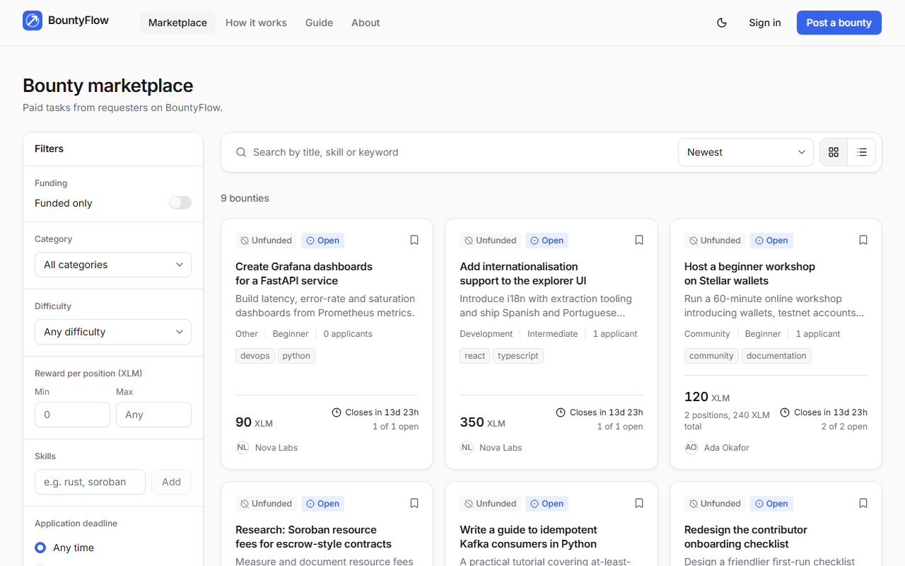
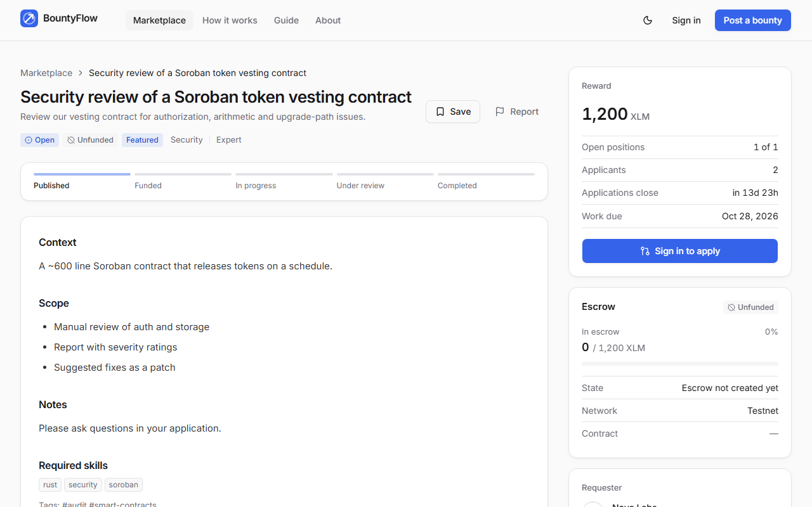
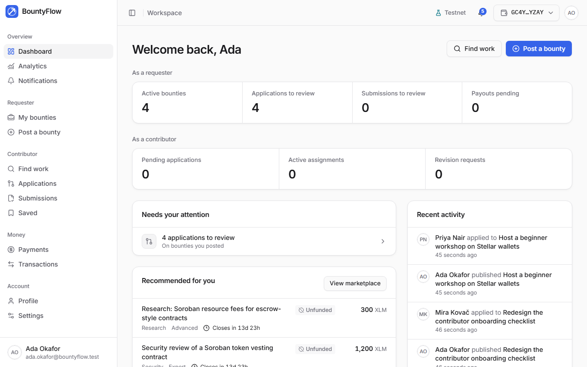
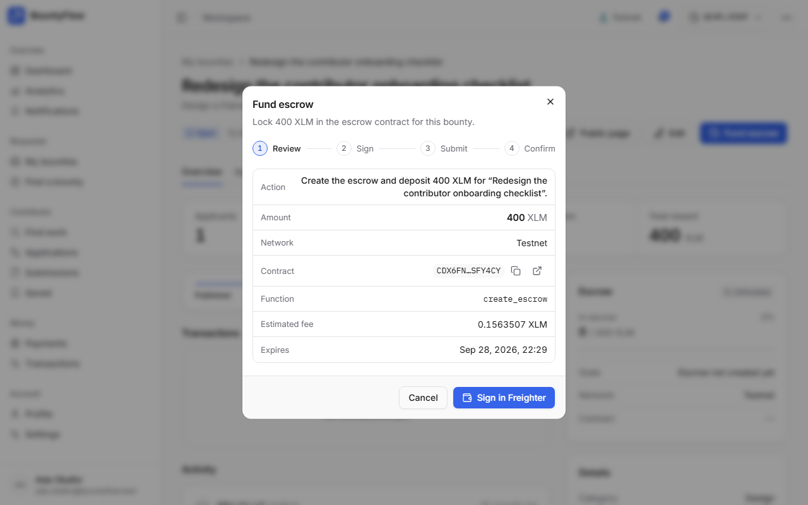
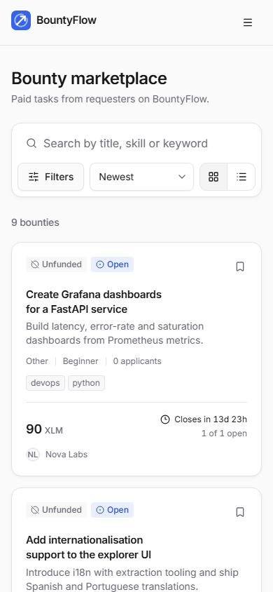
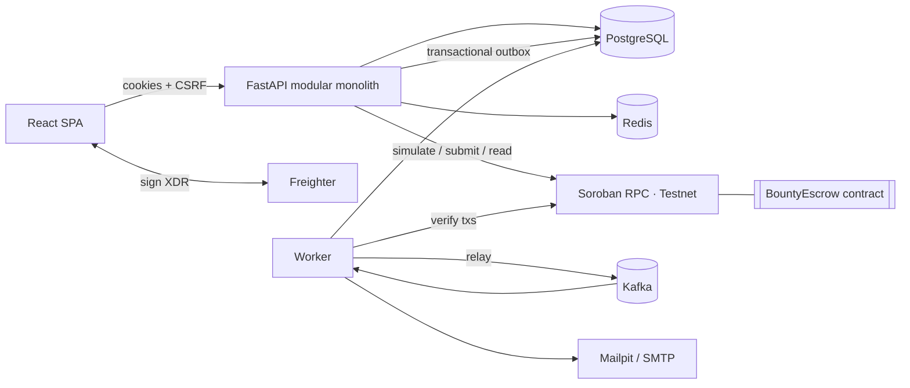

<div align="center">

<h1>BountyFlow</h1>

<p align="center">
  <strong>Work gets done. Rewards move transparently.</strong><br>
  Bounty rewards are held in a Soroban escrow contract on Stellar and paid out on-chain.
</p>

<p align="center">
  <a href="docs/blockchain.md"></a>
  <a href="https://stellar.expert/explorer/testnet/contract/CDX6FN2MIGLHCMUJOU6C7FYP3QTNDL6BVIPEG4B5HAUEPU7NI4SFY4CY"></a>
  <a href="./LICENSE"></a>
  <a href="https://www.freighter.app/"></a>
  <a href="docs/security.md"></a>
</p>

<p align="center">
  
  
  
  
  
  
  
  
  
  
</p>

<p align="center">
  <a href="#key-features">Features</a> ·
  <a href="#screenshots">Screenshots</a> ·
  <a href="#architecture">Architecture</a> ·
  <a href="#quick-start">Quick start</a> ·
  <a href="#makefile-commands">Commands</a> ·
  <a href="#documentation">Documentation</a> ·
  <a href="#security">Security</a> ·
  <a href="#contributing">Contributing</a> ·
  <a href="#license">License</a>
</p>

</div>

BountyFlow is a full-stack bounty marketplace on **Stellar**. Requesters post funded bounties, contributors apply
and deliver work, and rewards settle through a **Soroban escrow contract**. Every funding, payout and refund is
verified on-chain before the app records it.

> Runs on **Stellar Testnet**. Escrow contract
> [`CDX6FN2M…4SFY4CY`](https://stellar.expert/explorer/testnet/contract/CDX6FN2MIGLHCMUJOU6C7FYP3QTNDL6BVIPEG4B5HAUEPU7NI4SFY4CY).
> The full lifecycle has been exercised on-chain: escrow funding
> [`3e898e06…22a8`](https://stellar.expert/explorer/testnet/tx/3e898e0604ae024451cc8d751486f15377d2f1ff1575c8e8e708d103125e22a8)
> and payout
> [`7774ab36…5765`](https://stellar.expert/explorer/testnet/tx/7774ab3611874aeeb21eb09be609932d7664474b9a151718e6ea3e8e2cb75765).

---

## Contents

1. [Problem & solution](#problem--solution)
2. [Key features](#key-features)
3. [Screenshots](#screenshots)
4. [Architecture](#architecture)
5. [Technology stack](#technology-stack)
6. [Repository structure](#repository-structure)
7. [Quick start](#quick-start)
8. [Environment configuration](#environment-configuration)
9. [Database migrations & seed data](#database-migrations--seed-data)
10. [Makefile commands](#makefile-commands)
11. [API](#api)
12. [Kafka architecture](#kafka-architecture)
13. [Redis caching strategy](#redis-caching-strategy)
14. [Stellar Testnet & wallets](#stellar-testnet--wallets)
15. [Soroban contract](#soroban-contract)
16. [Testing](#testing)
17. [Troubleshooting](#troubleshooting)
18. [Documentation](#documentation)
19. [Security](#security)
20. [Known limitations](#known-limitations)
21. [Roadmap](#roadmap)
22. [Contributing](#contributing)
23. [License](#license)

## Problem & solution

**Problem.** Paying for small, well-defined work across the internet is built on trust. Contributors worry they
won't be paid after delivering. Requesters worry about paying for work that doesn't meet the brief. Payment
records are opaque, and "funded" labels usually mean nothing.

**Solution.** BountyFlow puts each bounty's reward into a Soroban escrow *before* anyone starts work. It tracks the
work through an explicit, auditable state machine. Only verified on-chain events move money-related state:
- A bounty is **Funded** only when the contract says so.
- A payment is **Confirmed** only when the contract reports the contributor as paid.
- A refund cannot bypass the contract's rules.

## Key features

- **Marketplace:** full-text search, filters (category, skills, reward, difficulty, deadline, status, funded
  only), sorting (newest, deadline, reward, documented popularity), pagination, bookmarks, reports.
- **Complete lifecycle:** draft → publish → fund escrow → apply → select → submit → revise → approve → on-chain
  payout, plus cancellation and refunds. Multi-position bounties and partial funding are supported.
- **Real Stellar integration:**
  - Any Stellar wallet through the Stellar Wallets Kit (Freighter, xBull, Albedo, LOBSTR, Hana and more), with
    SEP-10, SEP-53 or SEP-45 ownership proofs.
  - **Passkey smart wallets:** create a wallet in the browser with a passkey — no extension, no seed phrase, and
    no XLM needed to start.
  - **The platform pays contributors' network fees** for claiming, submitting and disputing, under per-user daily
    caps, so a contributor never needs to hold XLM.
  - Contract calls are built and preflighted on the server (Soroban RPC simulation) and signed in the wallet.
  - The server verifies the signed envelope, submits it, confirms the result, and reconciles from chain state.
- **Reward assets:** XLM, USDC or any Stellar asset an admin adds, moved through that asset's Stellar Asset
  Contract. Every amount carries its asset and totals are never added across assets. Trustlines are checked
  before funding, assignment and every payout, and the missing one is added in a single signed transaction.
- **Soroban escrow contract** in Rust (interface v2): access control, checked arithmetic, duplicate-payout
  prevention, refund conditions, and disputes with an M-of-N arbiter set. There is no admin withdrawal. It adds
  **milestone releases**, **batch payouts** (up to 10 contributors in one atomic transaction) and a **review
  window** — a contributor who records their work on-chain can claim the reward themselves if the requester never
  answers.
- **Disputes:** evidence, moderator review, and on-chain freeze and resolution, decided by an M-of-N arbiter set
  with split outcomes.
- **Notifications:** in-app and email (HTML templates), delivered asynchronously through Kafka with exactly-once
  email sending.
- **Dashboard and discovery:** requester and contributor views, an activity feed, **saved searches** with
  instant or digest alerts, and **skill-graph recommendations** built from real listings that always show which
  skills matched.
- **Analytics:** a documented methodology for every metric. Suspended accounts and moderator-hidden bounties are
  excluded, and every on-chain metric counts verified transactions only.
- **Administration:** RBAC (`USER` / `MODERATOR` / `ADMIN`) with a central permission matrix, user and bounty
  moderation, reports, a dispute queue, transaction monitoring, and an immutable audit log.
- **Proof of work:** every completed bounty is recorded in a separate Soroban attestation registry, and
  contributors can download a W3C Verifiable Credential for it. Anyone can check one at `/credentials/verify` —
  signature, revocation status, and a live read of the on-chain record.
- **Collaboration:** public questions and answers on every bounty (requester replies marked, one answer
  acceptable, pinning, moderation), GitHub accounts proved with a public gist, and linked pull requests verified
  through the GitHub API — repository, author, merge state and checks. Requesters can require a merged pull
  request before approving.
- **Compliance and privacy:** data export as a JSON archive delivered by a signed expiring link, account deletion
  after a cancellable grace period that anonymises while keeping required financial records, sanctions screening
  of wallet addresses at verification and before every payout, and versioned terms acceptance.
- **Operability:** a protected Prometheus `/metrics` endpoint, alert rules and a Grafana dashboard, backup and
  restore scripts, and twelve SRE runbooks in [docs/runbooks/](docs/runbooks/README.md). `STELLAR_NETWORK=mainnet`
  refuses to start until every requirement is met.
- **Security:** Argon2id, HttpOnly cookie sessions with refresh rotation and reuse detection, CSRF double-submit,
  rate limits, strict validation, safe markdown, security headers, and redacted structured logs (Logifyx).
- **Interface:** a premium, light-first design system with a warm dark theme (shadcn/ui + Tailwind v4 tokens, bold Bricolage Grotesque headlines over Geist),
  documented in [docs/design.md](docs/design.md). Every screen shows live data. Records are shown in tables, and
  the escrow state machine is a diagram whose states explain themselves on hover. On the landing page, "How a
  bounty moves" and the escrow diagram play as scroll stories (GSAP ScrollTrigger on sticky sections). Three.js
  (React Three Fiber) draws a constellation of payment pulses behind the hero, an interactive payments globe you
  can drag and click to send payments, and a ledger field. The rest of the motion is small:
  route fades, an animated light/dark switch, and Lenis smooth scrolling on the public site. Routes and heavy
  pieces (charts, Markdown, the wallet SDK, GSAP, Three.js, on-demand dialogs) load lazily. Loading states are
  boneyard skeletons captured from the real layout. Everything respects reduced motion; WCAG-minded and
  responsive from 360 px up.

## Screenshots

| Landing | Marketplace | Bounty detail |
|---|---|---|
|  |  |  |

| Dashboard | Chain action (sign & verify) | Mobile |
|---|---|---|
|  |  |  |

## Architecture



Details, sequence diagrams and design decisions: [docs/architecture.md](docs/architecture.md).

## Technology stack

| Layer | Technologies |
|---|---|
| Frontend | React 19, TypeScript (strict), Vite, React Router 7, Tailwind CSS v4, shadcn/ui (Radix), lucide-react, Bricolage Grotesque + Geist + IBM Plex Mono, GSAP (ScrollTrigger, DrawSVG), Three.js + React Three Fiber, Lenis, boneyard-js, Stellar Wallets Kit, passkey-kit (WebAuthn), TanStack Query, Zustand, React Hook Form + Zod, Recharts, Vitest, Testing Library, Playwright |
| Backend | Python 3.12, FastAPI, Uvicorn, Pydantic v2, pydantic-settings, SQLAlchemy 2.1 (async), Alembic, psycopg 3, redis-py, aiokafka, stellar-sdk (Soroban RPC), httpx, **Logifyx** logging, argon2-cffi, PyJWT, Jinja2, pytest, Ruff, mypy, **uv** |
| Data | PostgreSQL 17, Redis 7.4, Apache Kafka 3.9 (KRaft) |
| Blockchain | Stellar Testnet, Soroban (Rust, soroban-sdk 28), Stellar CLI 27, Stellar Asset Contracts (XLM, USDC and admin-added assets), Horizon, three deployed contracts (escrow v2, SEP-45 web auth, completion attestations), Stellar Wallets Kit and passkey smart wallets |
| Ops | Docker, Docker Compose, Make, GitHub Actions, Mailpit, Kafka UI |

## Repository structure

```
.
├── backend/                 FastAPI API + worker (uv project)
│   ├── app/
│   │   ├── core/            config, security, RBAC, logging, middleware, rate limits, money
│   │   ├── db/ cache/       SQLAlchemy base/session, Redis cache keys & invalidation
│   │   ├── messaging/       event envelope, payload schemas, outbox, Kafka, consumer registry
│   │   ├── blockchain/      network config, SEP-10 wallet proof, adapters, verification, reconciliation
│   │   ├── modules/         auth · users · bounties · applications · submissions · payments ·
│   │   │                    disputes · notifications · analytics · admin · dashboard
│   │   ├── api/             router + health/config endpoints
│   │   ├── scripts/seed.py  idempotent seed: accounts, profiles, bounties
│   │   └── templates/email/ HTML + text email templates
│   ├── worker/              Kafka consumers, outbox relay, periodic jobs, retry/DLQ
│   ├── migrations/          Alembic
│   └── tests/               unit · integration (API, security, bugs) · contract (Testnet E2E)
├── contracts/bounty_escrow/ Soroban escrow contract (Rust) + deployments/testnet.json
├── frontend/                React app (pages, components, API client, Stellar integration, e2e/)
├── infra/                   Postgres init, Kafka topic bootstrap
├── docs/                    architecture, api, database, blockchain, smart-contracts, security, …
├── scripts/                 contract deploy scripts (bash + PowerShell)
├── docker-compose.yml  Makefile  .env.example
```

## Quick start

Prerequisites: Docker, GNU Make + bash (Git Bash on Windows), [uv](https://docs.astral.sh/uv/),
Node 22 + pnpm. Rust and the Stellar CLI are needed only for contract work.

```bash
make install     # .env with a fresh JWT secret, backend + frontend dependencies
make dev         # Postgres/Redis/Kafka/Mailpit in Docker; migrate + seed; API, worker, Vite
```

Open http://localhost:5173/login and sign in with one of the [seeded accounts](#database-migrations--seed-data), or
register your own. Alternatively, run everything in containers with `make up` → http://localhost:3000.

| Service | URL |
|---|---|
| App | http://localhost:5173 (dev) · http://localhost:3000 (Docker) |
| API docs (OpenAPI) | http://localhost:8000/api/docs |
| Mailpit | http://localhost:8025 |
| Kafka UI | http://localhost:8080 (`make up-tools`) |

## Environment configuration

Everything is documented in [`.env.example`](.env.example). Settings are validated at startup, and production
refuses weak secrets and insecure cookies.

| Variable | Purpose |
|---|---|
| `BLOCKCHAIN_MODE` | `testnet` (default) · `mainnet` (separate, audited future deployment) |
| `SOROBAN_CONTRACT_ID`, `STELLAR_NATIVE_ASSET_CONTRACT_ID`, `STELLAR_ARBITER_ADDRESS` | Deployed escrow, native XLM SAC, dispute arbiter |
| `STELLAR_NETWORK_PASSPHRASE`, `STELLAR_HORIZON_URL`, `STELLAR_SOROBAN_RPC_URL`, `STELLAR_EXPLORER_BASE_URL` | Explicit network configuration |
| `RUN_MIGRATIONS_ON_STARTUP` | API applies migrations on boot (advisory-locked) |
| `SEED_ON_STARTUP` | API runs the **idempotent** seed on every boot (skipped in staging/production) |
| `SEED_USER_PASSWORD` | Password given to the seeded accounts (development only) |
| `DATABASE_URL`, `REDIS_URL`, `KAFKA_BOOTSTRAP_SERVERS` | Data stores |
| `JWT_SECRET`, `ACCESS_TOKEN_TTL`, `REFRESH_TOKEN_TTL`, `COOKIE_SECURE`, `COOKIE_SAMESITE` | Sessions |
| `SMTP_*`, `EMAIL_FROM` | Email (Mailpit locally) |
| `LOG_LEVEL`, `LOG_JSON`, `LOG_OUTPUT` | Logifyx logging |

## Database migrations & seed data

```bash
make migrate                       # alembic upgrade head
make migration m="describe change" # autogenerate a revision
make seed                          # idempotent: creates only missing accounts and bounties
make reset-db                      # DESTRUCTIVE (asks for confirmation)
```

The seed creates regular accounts with full profiles, plus bounties across every category, applications and
notifications. They are ordinary accounts and bounties: nothing is flagged or treated differently from data
created through the app. The seed never fabricates chain activity. Funding and payouts only happen when a real
wallet signs them. See [docs/database.md](docs/database.md).

Seeded accounts (sign in at `/login`):

| Email | Role | What the account has |
|---|---|---|
| `ada.okafor@bountyflow.test` | User | Posts bounties (requester) |
| `nova.labs@bountyflow.test` | User | Posts bounties (requester) |
| `kai.tanaka@bountyflow.test` | User | Applies to bounties (contributor) |
| `river.chen@bountyflow.test` | User | Contributor |
| `mira.kovac@bountyflow.test` | User | Contributor |
| `sol.adeyemi@bountyflow.test` | User | Contributor |
| `priya.nair@bountyflow.test` | Moderator | Moderation queue, disputes |
| `morgan.reyes@bountyflow.test` | Admin | Admin console, users, roles, audit log |

Every account uses the password in `SEED_USER_PASSWORD` (default `BountyFlow!2026`). `make seed` prints this list.

## Makefile commands

```
make help            make install         make dev             make up / down / restart / logs
make build           make test            make test-api        make test-frontend      make test-e2e
make test-testnet    make lint            make format          make typecheck          make migrate
make migration       make seed            make reset-db        make worker             make api
make contract-build  make contract-test   make contract-deploy-testnet                 make audit  make clean
```

## API

REST under `/api/v1`, with interactive OpenAPI at `/api/docs`. The contract is in [docs/api.md](docs/api.md):
cookie auth plus CSRF, a consistent error envelope, pagination and typed shapes. Health checks are at `/health`,
`/health/live` and `/health/ready`.

## Kafka architecture

State changes and their events commit together through a **transactional outbox**. The worker relays them to
Kafka topics (`bounty`, `application`, `submission`, `payment`, `notification`, `analytics`, `blockchain`,
`email` `.events`). Consumer groups provide idempotent handlers, bounded exponential retries and dead-letter
topics. See [docs/kafka-events.md](docs/kafka-events.md).

## Redis caching strategy

| Data | TTL | Invalidation |
|---|---|---|
| Marketplace queries, featured | 45–60 s | Generation counter bumped on any bounty change (O(1)) |
| Bounty detail (viewer-independent part) | 45 s | On update, publish, funding, acceptance, approval, payment |
| Public profile + stats | 120 s | On profile, wallet, assignment and payment changes |
| Public analytics | 60 s | On confirmed transactions |
| Rate limits, SEP-10 challenges, tx locks, view de-duplication | seconds–1 day | Expiry |

PostgreSQL stays the source of truth. Cache failures are logged and bypassed.

## Stellar Testnet & wallets

1. Install [Freighter](https://www.freighter.app/) and switch it to **Testnet**.
2. Fund your address with Friendbot: `https://friendbot.stellar.org/?addr=G...`.
3. In BountyFlow, go to **Profile → Wallets → Connect**, then sign the ownership challenge. It's free and never
   submitted.
4. Fund a bounty and approve the escrow transaction in Freighter. It is verified on-chain and linked to
   StellarExpert.

More in [docs/blockchain.md](docs/blockchain.md).

## Soroban contract

`contracts/bounty_escrow` provides `create_escrow`, `fund`, `assign`, `release`, `request_cancel`,
`consent_cancel`, `refund`, `raise_dispute`, `resolve_dispute`, and the views `get_escrow` and `assignment`. It has
36 unit tests.

```bash
make contract-test
make contract-build
make contract-deploy-testnet   # needs Stellar CLI; writes contracts/deployments/testnet.json
```

Trust assumptions and limitations: [docs/smart-contracts.md](docs/smart-contracts.md) and
[contracts/README.md](contracts/README.md).

## Testing

| Suite | Command |
|---|---|
| Backend unit + integration (isolated test DB, fakeredis, signed-XDR test chain) | `make test-api` |
| Real Stellar Testnet lifecycle (opt-in) | `make test-testnet` |
| Contract | `make contract-test` |
| Frontend unit | `make test-frontend` |
| Playwright E2E (desktop, tablet, mobile) | `make test-e2e` |

See [docs/testing.md](docs/testing.md).

## Troubleshooting

| Symptom | Fix |
|---|---|
| `Psycopg cannot use the 'ProactorEventLoop'` (Windows) | Start the API with `make api` / `python -m app.serve` |
| "On-chain escrow is not configured" | Set `SOROBAN_CONTRACT_ID` and `STELLAR_NATIVE_ASSET_CONTRACT_ID` (see `.env.example`) |
| `account_not_found` when funding | Fund the wallet with Friendbot |
| `email_not_verified` when publishing | Open the verification email in Mailpit |
| Kafka unreachable from the host | Use `localhost:9094` (external listener) |

More in [docs/development.md](docs/development.md).

## Documentation

| Document | What it covers |
|---|---|
| [docs/architecture.md](docs/architecture.md) | System overview, request lifecycle, module layout, funding and payout sequence, key decisions |
| [docs/api.md](docs/api.md) | REST contract under `/api/v1`: conventions, enums, shared shapes, endpoints |
| [docs/database.md](docs/database.md) | Entity relationships, tables, concurrency, search |
| [docs/blockchain.md](docs/blockchain.md) | Networks, wallet ownership proof, transaction lifecycle, real-network test |
| [docs/smart-contracts.md](docs/smart-contracts.md) | Testnet deployment, escrow model, trust assumptions, how the backend calls the contract |
| [contracts/README.md](contracts/README.md) | Full contract interface, state machine, storage, events, error codes, build and deploy |
| [docs/kafka-events.md](docs/kafka-events.md) | Topics, event envelope, reliability, running without Kafka, periodic jobs |
| [docs/security.md](docs/security.md) | Threat model, sessions, CSRF, RBAC, transaction verification, review findings |
| [docs/compliance.md](docs/compliance.md) | Custody posture, regulatory considerations, data protection, sanctions screening, the before-mainnet list |
| [docs/credentials.md](docs/credentials.md) | Verifiable credentials: format, issuer DID, revocation, how to verify one |
| [docs/github.md](docs/github.md) | GitHub account proof, pull request verification, and how it interacts with the review clock |
| [docs/discovery.md](docs/discovery.md) | Saved-search matching, the skill graph, ranking, and the offline evaluation |
| [docs/runbooks/README.md](docs/runbooks/README.md) | Twelve SRE runbooks: incidents, outages, backups, key rotation, contract upgrade, mainnet launch |
| [docs/testing.md](docs/testing.md) | Test suites, isolation, Playwright E2E scenarios, CI |
| [docs/development.md](docs/development.md) | Prerequisites, first run, backend and frontend conventions, troubleshooting |
| [docs/deployment.md](docs/deployment.md) | Images, production checklist, mainnet, scaling |
| [docs/product-roadmap.md](docs/product-roadmap.md) | What has shipped, what is next, current limitations |

## Security

A threat model, RBAC matrix, session and CSRF design, transaction verification and contract trust assumptions are
documented in [docs/security.md](docs/security.md). BountyFlow never asks for, receives or stores seed phrases or
private keys.

To report a vulnerability, use GitHub's private **Report a vulnerability** form on the repository's Security tab,
not a public issue. The policy, scope and security model summary are in [SECURITY.md](SECURITY.md).

## Known limitations

- A payout needs the requester's wallet signature, so the contract cannot force a release. A contributor who
  records their submission on-chain can claim it after the review window; work submitted only in BountyFlow has
  no on-chain clock. Disputes let an M-of-N arbiter set route **frozen** escrows.
- The contract admin can replace the contract code. Keep that key offline, and use a multisig account on mainnet.
- A trustline's 0.5 XLM reserve must come from the contributor's own account; BountyFlow pays only the fee.
- A lost, unsynced passkey is an unrecoverable wallet. BountyFlow holds no recovery key on purpose — holding one
  would make it custodial.
- Sanctions screening matches addresses against a configured list, not names, and is only as current as its source.
- Profiles and skills are self-reported. Wallet ownership, completed work (attestations) and linked GitHub
  accounts are verified; the rest is not.

## Roadmap

Multi-wallet support, passkey wallets, fee sponsorship, USDC and other Stellar assets, milestone escrows,
review-timeout claims, an M-of-N arbiter, batch payouts, on-chain attestations, verifiable credentials, saved
searches, recommendations, bounty Q&A, GitHub PR verification, and mainnet readiness have all shipped.

The remaining gate for mainnet is an **independent contract audit**: the startup guard refuses every contract id
until a real audit report is recorded in `deploy/audited-deployments.json`. Also open: KYC/AML decisions, name
screening, tax reporting, a non-custodial recovery path for passkey wallets, and sponsoring a trustline's reserve.
See [docs/product-roadmap.md](docs/product-roadmap.md).

## Contributing

1. `make install && make dev`
2. Keep `make check` green (lint, types, tests). Add tests with every change.
3. Database changes need an Alembic migration (`make migration m="..."`). API changes must update
   `docs/api.md`.
4. Never commit secrets. `.env` is ignored and the placeholders in `.env.example` are rejected in production.

Setup, quality gates, coding conventions and pull request guidelines are in [CONTRIBUTING.md](CONTRIBUTING.md).

## License

Released under the MIT License. See [LICENSE](./LICENSE).
