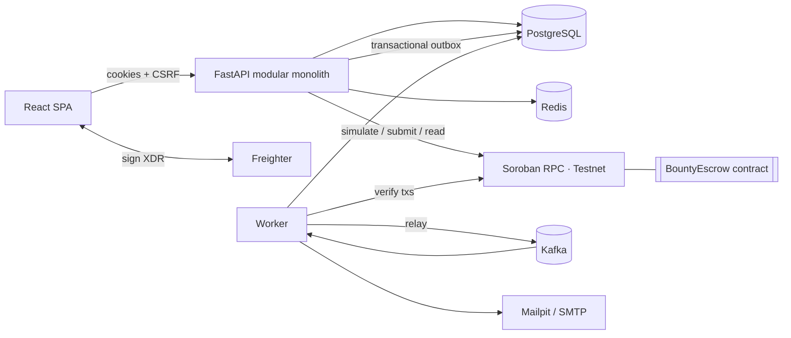

<div align="center">

<h1>BountyFlow</h1>

<p align="center">
  <strong>Work gets done. Rewards move transparently.</strong><br>
  Bounty rewards are held in a Soroban escrow contract on Stellar and paid out on-chain.
</p>

<p align="center">
  <a href="docs/blockchain.md"></a>
  <a href="https://stellar.expert/explorer/testnet/contract/CDX6FN2MIGLHCMUJOU6C7FYP3QTNDL6BVIPEG4B5HAUEPU7NI4SFY4CY"></a>
  <a href="./LICENSE"></a>
  <a href="https://www.freighter.app/"></a>
  <a href="docs/security.md"></a>
</p>

<p align="center">
  
  
  
  
  
  
  
  
  
  
</p>

<p align="center">
  <a href="#key-features">Features</a> ·
  <a href="#screenshots">Screenshots</a> ·
  <a href="#architecture">Architecture</a> ·
  <a href="#quick-start">Quick start</a> ·
  <a href="#makefile-commands">Commands</a> ·
  <a href="#documentation">Documentation</a> ·
  <a href="#user-onboarding--feedback">Feedback</a> ·
  <a href="#security">Security</a> ·
  <a href="#contributing">Contributing</a> ·
  <a href="#license">License</a>
</p>

</div>

BountyFlow is a full-stack bounty marketplace on **Stellar**. Requesters post funded bounties, contributors apply
and deliver work, and rewards settle through a **Soroban escrow contract**. Every funding, payout and refund is
verified on-chain before the app records it.

> Runs on **Stellar Testnet**. Escrow contract
> [`CDX6FN2M…4SFY4CY`](https://stellar.expert/explorer/testnet/contract/CDX6FN2MIGLHCMUJOU6C7FYP3QTNDL6BVIPEG4B5HAUEPU7NI4SFY4CY).
> The full lifecycle has been exercised on-chain: escrow funding
> [`3e898e06…22a8`](https://stellar.expert/explorer/testnet/tx/3e898e0604ae024451cc8d751486f15377d2f1ff1575c8e8e708d103125e22a8)
> and payout
> [`7774ab36…5765`](https://stellar.expert/explorer/testnet/tx/7774ab3611874aeeb21eb09be609932d7664474b9a151718e6ea3e8e2cb75765).

---

https://github.com/user-attachments/assets/879c7bd7-2359-46dd-a53e-9928a8acb115

---

## Contents

| Understand it | Run it | Build on it |
|---|---|---|
| [Problem & solution](#problem--solution) | [Quick start](#quick-start) | [API](#api) |
| [Key features](#key-features) | [Environment configuration](#environment-configuration) | [Kafka architecture](#kafka-architecture) |
| [Screenshots](#screenshots) | [Migrations & seed data](#database-migrations--seed-data) | [Redis caching strategy](#redis-caching-strategy) |
| [Architecture](#architecture) | [Makefile commands](#makefile-commands) | [Stellar Testnet & wallets](#stellar-testnet--wallets) |
| [Technology stack](#technology-stack) | [Troubleshooting](#troubleshooting) | [Soroban contract](#soroban-contract) |
| [Repository structure](#repository-structure) | [Testing](#testing) | [Documentation](#documentation) |

| Before you trust it | | |
|---|---|---|
| [Security](#security) | [Known limitations](#known-limitations) | [Roadmap](#roadmap) |
| [User onboarding & feedback](#user-onboarding--feedback) | | |
| [Contributing](#contributing) | [License](#license) | |

## Problem & solution

Paying for small, well-defined work across the internet runs on trust. Both sides carry a risk the platform
cannot remove — only hide.

| Who | The risk today | What BountyFlow changes |
|---|---|---|
| **Contributor** | Delivers the work, then waits or chases for the money | The reward is locked in escrow before they start, and anyone can read it on-chain |
| **Requester** | Pays up front and hopes the result matches the brief | Funds release on their approval, or by a contract rule they agreed to |
| **Both** | "Funded" is a label in someone else's database | "Funded" is a contract balance either side can verify |

### The rule everything else follows

Only verified on-chain events move money-related state. The server records what the chain confirms, and nothing
more.

| This state | Is set by | Never by |
|---|---|---|
| A bounty reading **Funded** | The escrow contract confirming it holds the reward | An application write |
| A payment reading **Confirmed** | The contract reporting the contributor as paid | A successful submission |
| A **refund** | The contract's own conditions | An administrator |

## Key features

### Marketplace & lifecycle

| Feature | What it does |
|---|---|
| **Search & filter** | Full-text search with filters for category, skills, reward, difficulty, deadline, status and funded-only |
| **Sorting & paging** | Newest, deadline, reward, and a documented popularity measure — all paginated |
| **Full lifecycle** | Draft → publish → fund escrow → apply → select → submit → revise → approve → on-chain payout |
| **Exits** | Cancellation and refunds, with multi-position bounties and partial funding supported |
| **Personal** | Bookmarks, saved searches, and reports on any listing |

### Stellar & wallets

| Feature | What it does |
|---|---|
| **Any Stellar wallet** | Freighter, xBull, Albedo, LOBSTR, Hana and more through the Stellar Wallets Kit |
| **Ownership proof** | SEP-10, SEP-53 or SEP-45 challenges, signed but never submitted |
| **Passkey smart wallets** | Create a wallet in the browser with a passkey — no extension, no seed phrase, no XLM to start |
| **Sponsored fees** | The platform pays contributors' network fees for claiming, submitting and disputing, under per-user daily caps |
| **Server-side preflight** | Calls are built and simulated against Soroban RPC, signed in the wallet, then verified before submission |

### The escrow contract

Rust, Soroban SDK 28, interface **v2**. Full interface, state machine and error codes:
[contracts/README.md](contracts/README.md).

| Capability | Detail |
|---|---|
| **Milestone releases** | Long work is paid in stages rather than all at the end |
| **Batch payouts** | Up to ten contributors in one atomic transaction |
| **Review window** | A contributor whose work is recorded on-chain can claim if the requester never answers |
| **Disputes** | An M-of-N arbiter set decides, and split outcomes are allowed |
| **Safety** | Checked arithmetic, duplicate-payout prevention, and explicit refund conditions |
| **No admin withdrawal** | There is no code path for the platform to take escrowed funds |

### Money & assets

| Feature | What it does |
|---|---|
| **Any Stellar asset** | XLM, USDC, or any asset an admin adds, moved through that asset's Stellar Asset Contract |
| **Amounts carry their asset** | Totals are never added across assets |
| **Trustline checks** | Verified before funding, assignment and every payout; a missing one is added in a single signed transaction |

### Trust & proof

| Feature | What it does |
|---|---|
| **On-chain attestations** | Every completed bounty is recorded in a separate Soroban attestation registry |
| **Verifiable credentials** | Contributors download a W3C credential for completed work |
| **Public verification** | Anyone can check one at `/credentials/verify` — signature, revocation, and a live read of the on-chain record |
| **GitHub proof** | Accounts proved with a public gist; pull requests verified for repository, author, merge state and checks |

### Collaboration & discovery

| Feature | What it does |
|---|---|
| **Questions & answers** | Public Q&A on every bounty, with requester replies marked, one acceptable answer, pinning and moderation |
| **Saved searches** | Instant or digest alerts when matching work appears |
| **Skill graph** | Recommendations built from real listings that always show which skills matched |
| **Dashboards** | Separate requester and contributor views with an activity feed |
| **In-product feedback** | A button on every screen sends bugs, ideas and praise straight to the maintainer's queue |

### Administration & moderation

| Feature | What it does |
|---|---|
| **RBAC** | `USER` / `MODERATOR` / `ADMIN` against a central permission matrix |
| **Queues** | User and bounty moderation, reports, disputes, feedback and transaction monitoring |
| **Audit log** | Immutable record of every administrative action |
| **Analytics** | A documented methodology per metric; suspended accounts and hidden bounties excluded, on-chain metrics count verified transactions only |

### Compliance & privacy

| Feature | What it does |
|---|---|
| **Data export** | A JSON archive delivered by a signed, expiring link |
| **Account deletion** | A cancellable grace period, then anonymisation that keeps required financial records |
| **Sanctions screening** | Wallet addresses screened at verification and before every payout |
| **Versioned terms** | Acceptance recorded against the document version in force |

### Operations & security

| Area | What ships |
|---|---|
| **Observability** | Protected Prometheus `/metrics`, alert rules, and a Grafana dashboard |
| **Runbooks** | Twelve SRE runbooks in [docs/runbooks/](docs/runbooks/README.md) |
| **Recovery** | Backup and restore scripts |
| **Mainnet guard** | `STELLAR_NETWORK=mainnet` refuses to start until every requirement is met |
| **Sessions** | Argon2id, HttpOnly cookies, refresh rotation with reuse detection |
| **Request safety** | CSRF double-submit, rate limits, strict validation, safe markdown, security headers |
| **Logs** | Structured and redacted by default (Logifyx) |

### Interface

| Area | What ships |
|---|---|
| **Design system** | Light-first with a warm dark theme — shadcn/ui on Tailwind v4 tokens, bold Bricolage Grotesque over Geist ([docs/design.md](docs/design.md)) |
| **Live data** | Every screen reads real records; the escrow state machine is a diagram that explains itself on hover |
| **Scroll stories** | "How a bounty moves" and the escrow diagram play as GSAP ScrollTrigger sequences on sticky sections |
| **3D** | A constellation of payment pulses behind the hero, a draggable payments globe, and a ledger field (Three.js / React Three Fiber) |
| **Restraint** | The rest of the motion is route fades, an animated theme switch, and Lenis smooth scrolling on the public site |
| **Performance** | Routes and heavy pieces (charts, Markdown, wallet SDK, GSAP, Three.js, dialogs) load lazily |
| **Loading** | Skeletons captured from the real layout (boneyard) |
| **Accessibility** | Reduced motion respected throughout, WCAG-minded, responsive from 360 px |

## Screenshots

| Landing | Marketplace | Bounty detail |
|---|---|---|
|  |  |  |

| Dashboard | Chain action (sign & verify) | Mobile |
|---|---|---|
|  |  |  |

### Walkthrough & pitch deck

The walkthrough is a recording of the running application, driven through the real UI — nothing is mocked or
animated. GitHub does not stream video from a repository path, so that link downloads the file rather than
playing it here; the PDFs open in the browser.

| Asset | Format | What it covers |
|---|---|---|
| **[Product walkthrough](BountyFlow-Product-Walkthrough.mp4)** | MP4 · 3 min 22 s · 1080p, narrated | Seven chapters: the landing page, finding work, a bounty in detail, the escrow state machine, the workspace, funding an escrow, and sending feedback |
| **[Pitch deck (PDF)](BountyFlow-Pitch-Deck.pdf)** | PDF · 7 slides · 16:9 | Problem, solution, how a bounty moves, market opportunity, architecture, growth strategy, roadmap |
| **[Pitch deck (PowerPoint)](BountyFlow-Pitch-Deck.pptx)** | PPTX · 7 slides · 16:9 | The same deck, editable |
| **[LinkedIn carousel](BountyFlow-LinkedIn-Carousel.pdf)** | PDF · 8 slides · square | The same story sized for a document post, where a 16:9 deck reads small on a phone |

## Architecture



Details, sequence diagrams and design decisions: [docs/architecture.md](docs/architecture.md).

## Technology stack

| Layer | Technologies |
|---|---|
| Frontend | React 19, TypeScript (strict), Vite, React Router 7, Tailwind CSS v4, shadcn/ui (Radix), lucide-react, Bricolage Grotesque + Geist + IBM Plex Mono, GSAP (ScrollTrigger, DrawSVG), Three.js + React Three Fiber, Lenis, boneyard-js, Stellar Wallets Kit, passkey-kit (WebAuthn), TanStack Query, Zustand, React Hook Form + Zod, Recharts, Vitest, Testing Library, Playwright |
| Backend | Python 3.12, FastAPI, Uvicorn, Pydantic v2, pydantic-settings, SQLAlchemy 2.1 (async), Alembic, psycopg 3, redis-py, aiokafka, stellar-sdk (Soroban RPC), httpx, **Logifyx** logging, argon2-cffi, PyJWT, Jinja2, pytest, Ruff, mypy, **uv** |
| Data | PostgreSQL 17, Redis 7.4, Apache Kafka 3.9 (KRaft) |
| Blockchain | Stellar Testnet, Soroban (Rust, soroban-sdk 28), Stellar CLI 27, Stellar Asset Contracts (XLM, USDC and admin-added assets), Horizon, three deployed contracts (escrow v2, SEP-45 web auth, completion attestations), Stellar Wallets Kit and passkey smart wallets |
| Ops | Docker, Docker Compose, Make, GitHub Actions, Mailpit, Kafka UI |

## Repository structure

```
.
├── backend/                 FastAPI API + worker (uv project)
│   ├── app/
│   │   ├── core/            config, security, RBAC, logging, middleware, rate limits, money
│   │   ├── db/ cache/       SQLAlchemy base/session, Redis cache keys & invalidation
│   │   ├── messaging/       event envelope, payload schemas, outbox, Kafka, consumer registry
│   │   ├── blockchain/      network config, SEP-10 wallet proof, adapters, verification, reconciliation
│   │   ├── modules/         22 modules: auth · users · wallets · bounties · applications ·
│   │   │                    submissions · escrow · payments · assets · disputes · qa ·
│   │   │                    credentials · reputation · discovery · github · notifications ·
│   │   │                    feedback · analytics · dashboard · admin · compliance · ops
│   │   ├── api/             router + health/config endpoints
│   │   ├── scripts/seed.py  idempotent seed: accounts, profiles, bounties
│   │   └── templates/email/ HTML + text email templates
│   ├── worker/              Kafka consumers, outbox relay, periodic jobs, retry/DLQ
│   ├── migrations/          Alembic
│   └── tests/               unit · integration (API, security, bugs) · contract (Testnet E2E)
├── contracts/bounty_escrow/ Soroban escrow contract (Rust) + deployments/testnet.json
├── frontend/                React app (pages, components, API client, Stellar integration, e2e/)
├── infra/                   Postgres init, Kafka topic bootstrap
├── docs/                    architecture, api, database, blockchain, smart-contracts, security, …
├── scripts/                 contract deploy scripts (bash + PowerShell)
├── docker-compose.yml  Makefile  .env.example
```

## Quick start

Prerequisites: Docker, GNU Make + bash (Git Bash on Windows), [uv](https://docs.astral.sh/uv/),
Node 22 + pnpm. Rust and the Stellar CLI are needed only for contract work.

```bash
make install     # .env with a fresh JWT secret, backend + frontend dependencies
make dev         # Postgres/Redis/Kafka/Mailpit in Docker; migrate + seed; API, worker, Vite
```

Open http://localhost:5173/login and sign in with one of the [seeded accounts](#database-migrations--seed-data), or
register your own. Alternatively, run everything in containers with `make up` → the same address.

| Service | URL |
|---|---|
| App | http://localhost:5173 — dev server and Docker both, so email links resolve either way (`FRONTEND_HOST_PORT`) |
| API docs (OpenAPI) | http://localhost:8000/api/docs |
| Mailpit | http://localhost:8025 |
| Kafka UI | http://localhost:8080 (`make up-tools`) |

## Environment configuration

Everything is documented in [`.env.example`](.env.example). Settings are validated at startup, and production
refuses weak secrets and insecure cookies.

| Variable | Purpose |
|---|---|
| `BLOCKCHAIN_MODE` | `testnet` (default) · `mainnet` (separate, audited future deployment) |
| `SOROBAN_CONTRACT_ID`, `STELLAR_NATIVE_ASSET_CONTRACT_ID`, `STELLAR_ARBITER_ADDRESS` | Deployed escrow, native XLM SAC, dispute arbiter |
| `STELLAR_NETWORK_PASSPHRASE`, `STELLAR_HORIZON_URL`, `STELLAR_SOROBAN_RPC_URL`, `STELLAR_EXPLORER_BASE_URL` | Explicit network configuration |
| `RUN_MIGRATIONS_ON_STARTUP` | API applies migrations on boot (advisory-locked) |
| `SEED_ON_STARTUP` | API runs the **idempotent** seed on every boot (skipped in staging/production) |
| `SEED_USER_PASSWORD` | Password given to the seeded accounts (development only) |
| `DATABASE_URL`, `REDIS_URL`, `KAFKA_BOOTSTRAP_SERVERS` | Data stores |
| `JWT_SECRET`, `ACCESS_TOKEN_TTL`, `REFRESH_TOKEN_TTL`, `COOKIE_SECURE`, `COOKIE_SAMESITE` | Sessions |
| `SMTP_*`, `EMAIL_FROM` | Email transport for development (Mailpit locally) |
| `GMAIL_CREDENTIALS_B64`, `GMAIL_SENDER`, `EMAIL_FROM_NAME` | Real email through the Gmail API; set these three and nothing else changes. Mint the credential with `scripts/mint_gmail_token.py` |
| `LOG_LEVEL`, `LOG_JSON`, `LOG_OUTPUT` | Logifyx logging |

## Database migrations & seed data

```bash
make migrate                       # alembic upgrade head
make migration m="describe change" # autogenerate a revision
make seed                          # idempotent: creates only the records that are missing
make reset-db                      # DESTRUCTIVE (asks for confirmation)
```

The seed creates 64 regular accounts with full profiles, 70 bounties across every category and difficulty (61
open, 9 draft), 154 applications, Q&A threads, bookmarks, saved searches, product feedback and notifications.
They are ordinary accounts and bounties: nothing is flagged or treated differently from data created through the
app. The seed never fabricates chain activity — no escrow, payment or attestation row is written and a seeded
bounty never gets past `open`. Funding and payouts only happen when a real wallet signs them. See
[docs/database.md](docs/database.md).

These eight accounts are the ones `make seed` prints — one of every role, plus both sides of the marketplace
(sign in at `/login`):

| Email | Role | What the account has |
|---|---|---|
| `ada.okafor@bountyflow.test` | User | Posts bounties (requester) |
| `nova.labs@bountyflow.test` | User | Posts bounties (requester) |
| `kai.tanaka@bountyflow.test` | User | Applies to bounties (contributor) |
| `river.chen@bountyflow.test` | User | Contributor |
| `mira.kovac@bountyflow.test` | User | Contributor |
| `sol.adeyemi@bountyflow.test` | User | Contributor |
| `priya.nair@bountyflow.test` | Moderator | Moderation queue, disputes |
| `morgan.reyes@bountyflow.test` | Admin | Admin console, users, roles, audit log |

The other 56 accounts are the requesters and contributors who fill the marketplace, the application queues and
the feedback inbox; their addresses follow the same `first.last@bountyflow.test` pattern. Every account uses the
password in `SEED_USER_PASSWORD` (default `BountyFlow!2026`).

## Makefile commands

```
make help            make install         make dev             make up / down / restart / logs
make build           make test            make test-api        make test-frontend      make test-e2e
make test-testnet    make lint            make format          make typecheck          make migrate
make migration       make seed            make reset-db        make worker             make api
make contract-build  make contract-test   make contract-deploy-testnet                 make audit  make clean
```

## API

REST under `/api/v1`, with interactive OpenAPI at `/api/docs`. The contract is in [docs/api.md](docs/api.md):
cookie auth plus CSRF, a consistent error envelope, pagination and typed shapes. Health checks are at `/health`,
`/health/live` and `/health/ready`.

## Kafka architecture

State changes and their events commit together through a **transactional outbox**. The worker relays them to
Kafka topics (`bounty`, `application`, `submission`, `payment`, `notification`, `analytics`, `blockchain`,
`email` `.events`). Consumer groups provide idempotent handlers, bounded exponential retries and dead-letter
topics. See [docs/kafka-events.md](docs/kafka-events.md).

## Redis caching strategy

| Data | TTL | Invalidation |
|---|---|---|
| Marketplace queries, featured | 45–60 s | Generation counter bumped on any bounty change (O(1)) |
| Bounty detail (viewer-independent part) | 45 s | On update, publish, funding, acceptance, approval, payment |
| Public profile + stats | 120 s | On profile, wallet, assignment and payment changes |
| Public analytics | 60 s | On confirmed transactions |
| Rate limits, SEP-10 challenges, tx locks, view de-duplication | seconds–1 day | Expiry |

PostgreSQL stays the source of truth. Cache failures are logged and bypassed.

## Stellar Testnet & wallets

1. Install [Freighter](https://www.freighter.app/) and switch it to **Testnet**.
2. Fund your address with Friendbot: `https://friendbot.stellar.org/?addr=G...`.
3. In BountyFlow, go to **Profile → Wallets → Connect**, then sign the ownership challenge. It's free and never
   submitted.
4. Fund a bounty and approve the escrow transaction in Freighter. It is verified on-chain and linked to
   StellarExpert.

More in [docs/blockchain.md](docs/blockchain.md).

## Soroban contract

`contracts/bounty_escrow` is the interface **v2** escrow. Three contracts are deployed to Testnet, with **91**
Rust tests between them — written adversarially, so most assert a panic on a specific error code.

| Group | Functions |
|---|---|
| **Lifecycle** | `create_escrow`, `create_escrow_v`, `fund`, `assign`, `release` |
| **Milestones & batching** | `release_milestone`, `batch_release` |
| **Review window** | `submit_work`, `request_changes`, `reject_submission`, `claim` |
| **Exits** | `request_cancel`, `consent_cancel`, `refund` |
| **Disputes** | `raise_dispute`, `resolve_dispute`, `vote_resolution` |
| **Views** | `get_escrow`, `assignment`, `review`, `resolution_votes`, `admin`, `min_review_window`, `version` |
| **Administration** | `set_admin`, `upgrade` — there is no withdrawal function |

| Contract | Rust tests |
|---|---|
| `bounty_escrow` | 70 |
| `attestations` | 16 |
| `web_auth` (SEP-45) | 5 |

```bash
make contract-test
make contract-build
make contract-deploy-testnet   # needs Stellar CLI; writes contracts/deployments/testnet.json
```

Trust assumptions and limitations: [docs/smart-contracts.md](docs/smart-contracts.md) and
[contracts/README.md](contracts/README.md).

## Testing

| Suite | Command |
|---|---|
| Backend unit + integration (isolated test DB, fakeredis, signed-XDR test chain) | `make test-api` |
| Real Stellar Testnet lifecycle (opt-in) | `make test-testnet` |
| Contract | `make contract-test` |
| Frontend unit | `make test-frontend` |
| Playwright E2E (desktop, tablet, mobile) | `make test-e2e` |

See [docs/testing.md](docs/testing.md).

## Troubleshooting

| Symptom | Fix |
|---|---|
| `Psycopg cannot use the 'ProactorEventLoop'` (Windows) | Start the API with `make api` / `python -m app.serve` |
| "On-chain escrow is not configured" | Set `SOROBAN_CONTRACT_ID` and `STELLAR_NATIVE_ASSET_CONTRACT_ID` (see `.env.example`) |
| `account_not_found` when funding | Fund the wallet with Friendbot |
| `email_not_verified` when publishing | Open the verification email in Mailpit |
| Kafka unreachable from the host | Use `localhost:9094` (external listener) |

More in [docs/development.md](docs/development.md).

## Documentation

Every document is indexed by task in **[docs/README.md](docs/README.md)**, and each one carries a navigation
line back to that index and on to its nearest neighbours.

| Document | What it covers |
|---|---|
| [docs/README.md](docs/README.md) | The index: which document answers which question |
| [docs/architecture.md](docs/architecture.md) | System overview, request lifecycle, module layout, funding and payout sequence, key decisions |
| [docs/api.md](docs/api.md) | REST contract under `/api/v1`: conventions, enums, shared shapes, endpoints |
| [docs/database.md](docs/database.md) | Entity relationships, tables, concurrency, search |
| [docs/blockchain.md](docs/blockchain.md) | Networks, wallet ownership proof, transaction lifecycle, real-network test |
| [docs/smart-contracts.md](docs/smart-contracts.md) | Testnet deployment, escrow model, trust assumptions, how the backend calls the contract |
| [contracts/README.md](contracts/README.md) | Full contract interface, state machine, storage, events, error codes, build and deploy |
| [docs/kafka-events.md](docs/kafka-events.md) | Topics, event envelope, reliability, running without Kafka, periodic jobs |
| [docs/security.md](docs/security.md) | Threat model, sessions, CSRF, RBAC, transaction verification, review findings |
| [docs/compliance.md](docs/compliance.md) | Custody posture, regulatory considerations, data protection, sanctions screening, the before-mainnet list |
| [docs/credentials.md](docs/credentials.md) | Verifiable credentials: format, issuer DID, revocation, how to verify one |
| [docs/github.md](docs/github.md) | GitHub account proof, pull request verification, and how it interacts with the review clock |
| [docs/discovery.md](docs/discovery.md) | Saved-search matching, the skill graph, ranking, and the offline evaluation |
| [docs/runbooks/README.md](docs/runbooks/README.md) | Twelve SRE runbooks: incidents, outages, backups, key rotation, contract upgrade, mainnet launch |
| [docs/testing.md](docs/testing.md) | Test suites, isolation, Playwright E2E scenarios, CI |
| [docs/development.md](docs/development.md) | Prerequisites, first run, backend and frontend conventions, troubleshooting |
| [docs/deployment.md](docs/deployment.md) | Images, production checklist, mainnet, scaling |
| [docs/product-roadmap.md](docs/product-roadmap.md) | What has shipped, what is next, current limitations |

## Security

A threat model, RBAC matrix, session and CSRF design, transaction verification and contract trust assumptions are
documented in [docs/security.md](docs/security.md). BountyFlow never asks for, receives or stores seed phrases or
private keys.

To report a vulnerability, use GitHub's private **Report a vulnerability** form on the repository's Security tab,
not a public issue. The policy, scope and security model summary are in [SECURITY.md](SECURITY.md).

## Known limitations

| Limitation | Why it exists | What softens it |
|---|---|---|
| **A payout needs the requester's signature** | The contract cannot force a release | A contributor who records their submission on-chain can claim after the review window; disputes let an M-of-N arbiter set route frozen escrows |
| **Work submitted only in BountyFlow has no on-chain clock** | The review-timeout claim reads chain state | Record the submission on-chain to start the clock |
| **The contract admin can replace the code** | Upgradeability was kept for fixes | Keep that key offline, and use a multisig account on mainnet |
| **A trustline's 0.5 XLM reserve is the contributor's own** | Reserves are a protocol rule | BountyFlow pays the network fee; sponsoring the reserve is on the roadmap |
| **A lost, unsynced passkey is unrecoverable** | Deliberate — holding a recovery key would make BountyFlow custodial | A non-custodial recovery path is on the roadmap |
| **Sanctions screening matches addresses, not names** | It screens what it can verify | It is only as current as its configured source |
| **Profiles and skills are self-reported** | Nobody attests to a bio | Wallet ownership, completed work and linked GitHub accounts *are* verified |

## Roadmap

### Shipped

| Area | What landed |
|---|---|
| **Wallets** | Multi-wallet support, passkey smart wallets, fee sponsorship |
| **Money** | USDC and other Stellar assets, milestone escrows, batch payouts |
| **Fairness** | Review-timeout claims, an M-of-N arbiter set |
| **Proof** | On-chain attestations, verifiable credentials |
| **Discovery** | Saved searches, skill-graph recommendations, bounty Q&A, GitHub PR verification |
| **Listening** | In-product feedback with an admin triage queue |

### Next

| Theme | What is left | What blocks it |
|---|---|---|
| **Mainnet** | The deployment itself | An **independent contract audit** — the startup guard refuses every contract id until a real report is recorded in `deploy/audited-deployments.json` |
| **Compliance** | KYC/AML decisions, name screening, geographic controls, tax reporting | Policy decisions, not code |
| **Wallets** | A recovery path for passkey wallets | It must not make BountyFlow custodial |
| **Payments** | Sponsoring a trustline's reserve | So a contributor holding no XLM can be paid in USDC |
| **Escrow** | An on-chain pause for emergencies | The contract is permissionless by design today |

Full detail in [docs/product-roadmap.md](docs/product-roadmap.md).

## User onboarding & feedback

Real users are onboarded through a short Google Form that collects their name, email, Stellar wallet address and
a rating of the product. Responses append to a linked Google Sheet, which is exported to Excel for analysis and
record-keeping, and the themes that come out of it set what gets built next.

| | Link |
|---|---|
| **Onboarding form** — share this with users | *(add the live form URL once the form exists)* |
| **Responses (Google Sheet)** — live, access-controlled | *(add the Sheet URL once the form exists)* |
| **Exported responses (Excel)** | [`docs/onboarding/bountyflow-onboarding.xlsx`](docs/onboarding/bountyflow-onboarding.xlsx) |

The nine questions, their validation rules, the settings to change from Google's defaults and the export steps
are all in **[docs/user-onboarding.md](docs/user-onboarding.md)** — that page is the specification, so it changes
in the same commit as the form does. Responses are exported from the Sheet with **File → Download → Microsoft
Excel** and committed, so the record survives independently of the Google account that owns it.

In-product feedback is a separate stream, kept separate on purpose: it lives in the `feedback` table and is
triaged at `/admin/feedback`. Both use the same four categories — Bug, Idea, Praise, Other — so they read
together without being merged into one sheet where it would stop being clear which evidence came from where.

The form asks for a **public key only**. No question on it, and no part of BountyFlow, ever asks for a secret key
or a recovery phrase.

### How the next phase is built from this feedback

Feedback is grouped by theme rather than counted by response: several people describing the same confusing step
is one problem. Two things earn a place in the next phase — a theme that recurs across responses, or a single
response describing something genuinely broken. Everything that ships is linked to the commit that shipped it,
so a reader can trace a piece of feedback to the diff that answered it.

| Signal from users | What changes next | Commit |
|---|---|---|
| Feedback arrived over DMs and issues, so it was never counted or triaged | An in-product feedback widget on every page, with typed categories (Bug / Idea / Praise / Other) feeding an admin triage queue — the same categories the form uses, so both sources land in one queue | [`2467777`](https://github.com/Madhur-Prakash/Stellar-BountyFlow/commit/246777717e5b371faf3c02b419e17caca5301a36) |
| People lost their place in the bounty → application → submission → payout flow | Breadcrumbs on every nested page, so the current step and the way back are always on screen | [`ff44f42`](https://github.com/Madhur-Prakash/Stellar-BountyFlow/commit/ff44f42c9eab5bf3e556cf9f943fd125290379c9), [`3372431`](https://github.com/Madhur-Prakash/Stellar-BountyFlow/commit/3372431608843b00825845b7180f8c151ec93c94) |
| Contributors could not tell what was maintained, or how quickly a PR would be looked at | Maintenance and contribution expectations stated plainly — one maintainer, no schedule, small changes land fast | [`3b848e3`](https://github.com/Madhur-Prakash/Stellar-BountyFlow/commit/3b848e3974f0bf83fb0b9002fb2e932af40603a4) |

Where the ratings point next, in priority order:

1. **A low score on question 6** (*ease of connecting a wallet and moving money*) against a high overall rating
   means the product is wanted but the money path is hard. That ordering puts **sponsoring a trustline's reserve**
   first, so a contributor holding no XLM can still be paid in USDC.
2. **Bug-category responses** are triaged ahead of everything else, each as its own issue, each closed by a
   commit linked back into the table above.
3. **Idea-category themes** are weighed against the [Roadmap](#roadmap) — a recurring one is promoted into
   *Next*, a one-off is recorded in [docs/product-roadmap.md](docs/product-roadmap.md) and left there.

Commits landing after this table is written are appended to it in the same shape, one row per shipped response.

## Contributing

BountyFlow is built and maintained by **one person**, not a team. Issues are read and pull requests are
reviewed, but neither is on a schedule: small, focused changes land quickly, and larger ones land only if the
shape was agreed in an issue before the code was written.

1. `make install && make dev`
2. Keep `make check` green (lint, types, tests). Add tests with every change.
3. Database changes need an Alembic migration (`make migration m="..."`). API changes must update
   `docs/api.md`.
4. Never commit secrets. `.env` is ignored and the placeholders in `.env.example` are rejected in production.

Setup, quality gates, coding conventions and pull request guidelines are in [CONTRIBUTING.md](CONTRIBUTING.md).

## License

Released under the MIT License. See [LICENSE](./LICENSE).
