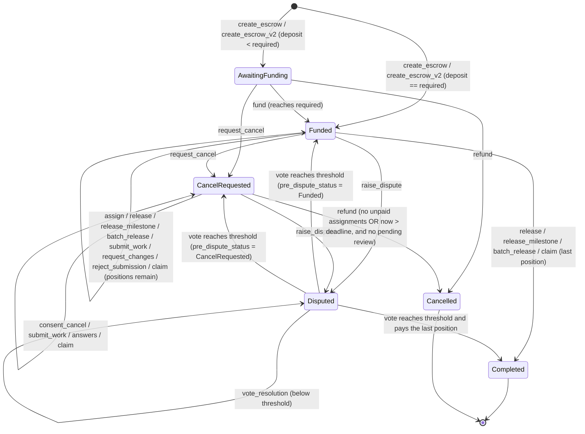
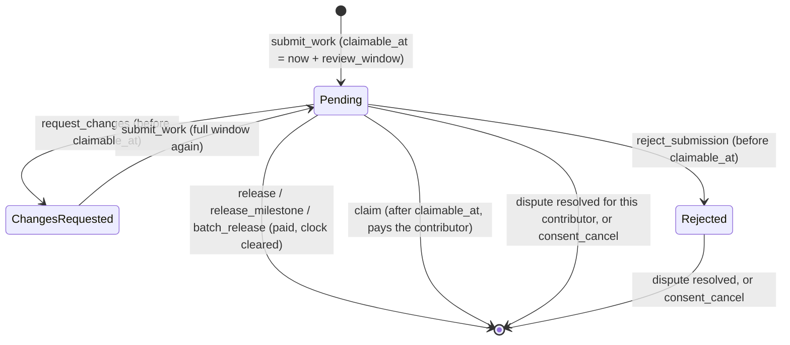

# BountyFlow Soroban contracts

`bounty_escrow` is the on-chain escrow behind BountyFlow. A requester locks
`reward_per_position * positions` of a token, assigns contributors to
positions, and releases one fixed reward per position, or, on a single-position
bounty, one milestone at a time. A contributor can record submitted work
on-chain; if the requester does not answer within the escrow's review window,
the contributor claims the payment. Cancellation needs the consent of every
assigned contributor who has not been paid, or the deadline to have passed. An
M-of-N arbiter set settles disputes, and the only thing the arbiters can do is
pay an assigned contributor (all or part of their position, the rest going back
to the requester) or remove that contributor's assignment.

- SDK: `soroban-sdk` 28.0.0 (Rust 1.96, target `wasm32v1-none`)
- Stellar CLI: 27.0.0 (CI installs the same version). soroban-sdk 28 needs stellar-cli v25.2.0 or newer to build
  the contract wasm; see [Build, test, deploy](#build-test-deploy).
- Contract interface version: `version() == 2`. Every v1 entry point keeps its name, arguments and behaviour.

## Deployed (Stellar Testnet)

| Item | Value |
|---|---|
| Contract id (v2) | `CBCXG46FJPYBPWYZ24BWFVNJ6G2ILFAXHX2COETDNXYE6C5IJWAZ3M4C` ([explorer](https://stellar.expert/explorer/testnet/contract/CBCXG46FJPYBPWYZ24BWFVNJ6G2ILFAXHX2COETDNXYE6C5IJWAZ3M4C)) |
| Wasm hash | `f9b88bca3b3b90e39e33007be337945c28395e1b9464567d3b2a2c8aed810d8a` |
| Admin (`bountyflow-escrow-admin`) | `GAXPFJGPZ2X2DLQWKLQKUAX55MBY7SRXHK2HGC2KAV5QHOP6QCSDD26R` |
| Minimum review window | 60 seconds (Testnet only, so the claim flow can be tested; mainnet uses 86,400) |
| Arbiter set (2 of 3) | `GDKMJJGPM7ZFTDG6Y74O6JA2QCMQBEJJE7Q7I5FGKI77Z67XXY2C3LU2` (`bountyflow-arbiter`), `GBC4ELFGZ4EO2A7Q33GKNZ2RJRCQ56CGV4MP4RHKPEE4AXNN6ESJCZMA` (`bountyflow-arbiter-2`), `GCS2KVV474R2V4M2CY45SINSNO7FPMOCBUE7WGH7UWHPXCSRGV3HHG5U` (`bountyflow-arbiter-3`) |
| Native XLM SAC id | `CDLZFC3SYJYDZT7K67VZ75HPJVIEUVNIXF47ZG2FB2RMQQVU2HHGCYSC` |
| Deployer (`bountyflow-deployer`) | `GD646RGJJOHCMJDICTLPTPZXYQSS2Y4IZBOWEAYU2AU7PAT7ESKZKPE5` |
| v1 contract (still in use) | `CDX6FN2MIGLHCMUJOU6C7FYP3QTNDL6BVIPEG4B5HAUEPU7NI4SFY4CY` (wasm `a8ed0b13…2966`) |

The arbiter set and threshold are not deployment settings: each escrow stores its own, chosen by the backend
(`STELLAR_ARBITER_ADDRESSES`, `STELLAR_ARBITER_THRESHOLD`) when it prepares `create_escrow_v2`.

The v1 contract could not be upgraded in place (it has no admin and no upgrade entry point), so v2 is a new
contract. Escrows created on v1 stay on it: BountyFlow stores the contract id of every escrow
(`bounty_escrows.contract_id`) and keeps calling the v1 contract for them. New escrows go to v2.

[`deployments/testnet.json`](deployments/testnet.json) is the machine-readable record. It also holds the v2
smoke-test transactions (claim after timeout, milestone release, batch release, a 2-of-3 split, and the upgrade
authorization check) and the superseded deployments.

## Layout

```
contracts/
  Cargo.toml                 workspace + Soroban release profile
  Cargo.lock
  bounty_escrow/
    Makefile                 build / test / fmt / clippy / optimize
    src/lib.rs               contract + public API
    src/storage.rs           DataKey, escrow/assignment/review/vote IO, TTL policy
    src/types.rs             Escrow, EscrowTerms, Review, Milestone, PayoutItem, Vote
    src/errors.rs            Error codes
    src/events.rs            #[contractevent] structs
    src/test.rs              unit tests (70)
    test_fixtures/           add_u64.wasm, the stand-in wasm for the upgrade test
  deployments/testnet.json   written by scripts/deploy-contract.{sh,ps1}
```

## Public interface

`bounty_id` is a `BytesN<32>`. The CLI and JSON take it as 64 hex characters.
Amounts are `i128` in the token's smallest unit. For XLM that is stroops, and
1 XLM = 10,000,000. Every state-changing escrow function returns
`Result<Escrow, Error>` holding the updated escrow.

### Deployment and administration

| Function | Auth | Effect |
|---|---|---|
| `__constructor(admin, min_review_window)` | (deploy) | Stores the admin and the shortest review window escrows on this deployment may use. Panics with `InvalidReviewWindow` unless `60 <= min_review_window <= 604800`. |
| `upgrade(new_wasm_hash)` | admin | Replaces the contract code with an uploaded wasm. Escrow storage is kept. Emits `contract_upgraded`. |
| `set_admin(new_admin)` | current admin **and** new admin | Hands over the admin role (both sign, so it cannot be sent to a mistyped address). Emits `admin_changed`. |
| `admin() -> Address`, `min_review_window() -> u64`, `version() -> u32` | none | Read-only. `version()` returns `2`. |

### Escrow lifecycle

| Function | Auth | Allowed from status | Effect |
|---|---|---|---|
| `create_escrow(requester, bounty_id, token, reward_per_position, positions, arbiter, deadline, initial_deposit)` | requester | (new id) | v1 arguments. Same as `create_escrow_v2` with `arbiters = [arbiter]`, `threshold = 1`, a 7-day review window and no milestones. |
| `create_escrow_v2(requester, bounty_id, token, terms: EscrowTerms)` | requester | (new id) | Creates the escrow. `required = reward * positions`. Transfers `initial_deposit` if > 0. Status is `Funded` when fully funded, otherwise `AwaitingFunding`. Emits `escrow_created`, `escrow_configured` and (with a deposit) `escrow_funded`. |
| `fund(requester, bounty_id, amount)` | requester | AwaitingFunding | Transfers `amount` in. Status becomes `Funded` when `funded == required`. |
| `assign(requester, bounty_id, contributor)` | requester | Funded, and `now < deadline` | Reserves a position (`Assigned`). |
| `release(requester, bounty_id, contributor)` | requester | Funded | Pays one position: the reward, or every open milestone on a milestone escrow. The contributor can be pre-assigned or, if a position is free, paid directly. |
| `release_milestone(requester, bounty_id, contributor, milestone)` | requester | Funded | Pays one milestone to the contributor holding (or taking) the single position. The last one completes the position. |
| `batch_release(requester, bounty_id, items: Vec<PayoutItem>)` | requester | Funded | Pays 1 to 10 legs (`Position(contributor)` or `Milestone(contributor, index)`) in one call. Every leg is checked and booked before any transfer; one bad leg fails the whole call. |
| `submit_work(contributor, bounty_id, milestone)` | assigned contributor | Funded, CancelRequested; `now < deadline` | Records a submission (milestone index, 0 without milestones) and starts the review window: `claimable_at = now + review_window`. |
| `request_changes(requester, bounty_id, contributor)` | requester | Funded, CancelRequested | Before the window passes: stops the clock (`ChangesRequested`). The next `submit_work` starts a full window. |
| `reject_submission(requester, bounty_id, contributor)` | requester | Funded, CancelRequested | Before the window passes: `Rejected`. The contributor stays assigned; only a dispute (or consenting to a cancellation) moves it on. |
| `claim(contributor, bounty_id)` | contributor | Funded, CancelRequested | After an unanswered window: pays the contributor the submitted work (their position, or the submitted milestone). |
| `request_cancel(requester, bounty_id)` | requester | AwaitingFunding, Funded | Status becomes `CancelRequested`. |
| `consent_cancel(contributor, bounty_id)` | contributor | CancelRequested | The assigned contributor gives up their position and any recorded submission. |
| `refund(requester, bounty_id)` | requester | AwaitingFunding, CancelRequested | Needs no assigned-but-unpaid contributor (or `now > deadline`) **and** no pending review. Returns all unspent funds. Status becomes `Cancelled`. |
| `raise_dispute(caller, bounty_id)` | requester or an assigned contributor | Funded, CancelRequested; someone assigned and unpaid | Status becomes `Disputed`; `dispute_round += 1` (votes of earlier rounds no longer count). Claims wait. |
| `vote_resolution(arbiter, bounty_id, contributor, contributor_amount)` | an arbiter of this escrow | Disputed | Records the arbiter's approval of "pay `contributor_amount` (0 to the whole open position) to this assigned contributor, the rest of the position back to the requester". Executes when `threshold` arbiters approved exactly the same contributor and amount in this round. `0` removes the assignment instead. |
| `resolve_dispute(arbiter, bounty_id, contributor, pay_contributor)` | an arbiter | Disputed | v1 arguments: a vote for the whole position (`true`) or for 0 (`false`). With a threshold of 1 it executes at once, as in v1. |
| `get_escrow`, `assignment`, `review(bounty_id, contributor) -> Option<Review>`, `resolution_votes(bounty_id) -> Vec<ArbiterVote>` | none | any | Read-only. |

When a resolution executes, the votes are cleared, the contributor's review is cleared, any milestones left on the
position are marked settled, and `clock_reset_at` is set to the ledger time: every other pending review gets a full
window again from that moment, so a requester is never out of time because of a dispute. A position that ends up
fully paid with money left over (a split) returns the rest to the requester in the same call.

### Types

```rust
enum EscrowStatus { AwaitingFunding = 0, Funded = 1, CancelRequested = 2, Disputed = 3, Completed = 4, Cancelled = 5 }
enum AssignmentState { Assigned = 0, Paid = 1 }
enum ReviewState { Pending = 0, ChangesRequested = 1, Rejected = 2 }

struct EscrowTerms {
  reward_per_position: i128, positions: u32, deadline: u64, initial_deposit: i128,
  arbiters: Vec<Address>, threshold: u32, review_window: u64, milestones: Vec<i128>,
}
enum PayoutItem { Position(Address), Milestone(Address, u32) }
struct Review { milestone: u32, submitted_at: u64, claimable_at: u64, state: ReviewState }
struct Milestone { amount: i128, paid: bool }
struct ArbiterVote { arbiter: Address, contributor: Address, contributor_amount: i128 }

struct Escrow {
  // v1 layout
  requester: Address, token: Address, arbiter: Address,
  reward_per_position: i128, positions: u32, required_amount: i128,
  funded_amount: i128, paid_out_amount: i128, refunded_amount: i128,
  payouts_made: u32, assigned_unpaid: u32, deadline: u64,
  status: EscrowStatus, pre_dispute_status: EscrowStatus, created_at: u64,
  // v2
  arbiters: Vec<Address>, threshold: u32, review_window: u64, pending_reviews: u32,
  dispute_round: u32, clock_reset_at: u64, milestones: Vec<Milestone>,
}
```

`arbiter` is the first entry of `arbiters`, so readers of the v1 layout still see an arbiter. The integer enums
serialize as `u32` (for example `"status": 1` in CLI JSON). `i128` values show up as decimal strings in CLI JSON.

### Validation rules (creation)

| Check | Error |
|---|---|
| `bounty_id` already used | `AlreadyExists` |
| `reward_per_position <= 0` | `InvalidAmount` |
| `positions == 0 \|\| positions > 100` | `InvalidPositions` |
| no arbiter, more than 10, a duplicate, or the requester among them | `InvalidArbiter` |
| `threshold == 0 \|\| threshold > arbiters.len()` | `InvalidThreshold` |
| `deadline <= ledger.timestamp()` | `DeadlineInPast` |
| `review_window < min_review_window()` or `> 30 days` | `InvalidReviewWindow` |
| milestones on more than one position, more than 20, an amount `<= 0`, or a total other than the reward | `InvalidMilestones` |
| `reward * positions` overflows i128 | `Overflow` |
| `initial_deposit < 0` / `> required` | `InvalidAmount` / `Overfunded` |

The other functions work like this:

- A function that names a `requester` checks that it equals `escrow.requester` and returns `Unauthorized` if not.
- `assign` returns `DeadlineInPast` once `ledger.timestamp() >= deadline`, `Unauthorized` if `contributor == requester`, `AlreadyAssigned` if the contributor is already assigned or paid, and `PositionsExhausted` when no position is free.
- `release`, `release_milestone` and `batch_release` return `AlreadyPaid` for a paid contributor, `InvalidMilestone` for an index out of range, `MilestoneAlreadyPaid` for a paid milestone, and `InvalidBatch` for an empty batch or one over 10 legs.
- `submit_work` returns `NotAssigned`, `ReviewPending` (already recorded and running), `WorkRejected` (rejected on-chain) or `DeadlineInPast`.
- `request_changes` / `reject_submission` return `NoPendingReview`, or `ReviewWindowElapsed` once the window has passed (from then on only paying, or a dispute, is open to the requester).
- `claim` returns `NoPendingReview`, or `ReviewWindowOpen` before `claimable_at` (the later of `submitted_at + window` and `clock_reset_at + window`).
- `refund` returns `ReviewPending` while a recorded submission waits for an answer, even after the deadline.
- `vote_resolution` returns `Unauthorized` for a non-arbiter, `NotAssigned` for a contributor without a position, and `InvalidResolution` for an amount below 0 or above the open position.
- Paying a milestone or a position clears that contributor's pending review, so a paid submission can never be claimed as well.
- All arithmetic is checked (`Overflow`). The release profile also keeps `overflow-checks = true`.

## State machine



Review clock of one contributor's submission:



While an escrow is `Disputed`, `release`, `release_milestone`, `batch_release`, `assign`, `fund`, `request_cancel`,
`refund`, `submit_work`, the review answers and `claim` all fail with `InvalidState`. `Completed` and `Cancelled` are
terminal.

## Authorization

| Caller | Can |
|---|---|
| Requester | create, fund, assign, release (any form), answer reviews, request cancellation, refund, raise a dispute |
| Assigned contributor | record work, claim after the window, consent to cancellation, raise a dispute |
| Arbiter of the escrow | vote on a resolution for an assigned contributor while the escrow is `Disputed` |
| Admin | upgrade the code, hand over the admin role (with the new admin's signature) |
| Anyone | read |

The admin cannot move escrowed funds, change an escrow's terms, or act as an arbiter. Its one power is replacing the
code, which is why the admin key must be a hardware wallet or a multisig account on mainnet (see
`docs/security.md`).

## Storage schema

| Key | Storage | Value |
|---|---|---|
| `DataKey::Escrow(BytesN<32>)` | persistent | `Escrow` |
| `DataKey::Assignment(BytesN<32>, Address)` | persistent | `AssignmentState` (a missing key means not assigned) |
| `DataKey::Review(BytesN<32>, Address)` | persistent | `Review` (removed when the work is paid, claimed, or the position is settled) |
| `DataKey::Vote(BytesN<32>, Address)` | persistent | `Vote` of one arbiter (cleared when a resolution executes; stale rounds are ignored) |
| `DataKey::Admin` | instance | `Address` |
| `DataKey::MinReviewWindow` | instance | `u64` |

**TTL policy** (`src/storage.rs`):

- `BUMP_THRESHOLD` is 15 days (259,200 ledgers) and `BUMP_TO` is 30 days (518,400 ledgers), at about 5 s per ledger.
- Every write, and every read made inside a state-changing call, extends the entry to `BUMP_TO` once its remaining TTL falls below `BUMP_THRESHOLD`. The contract instance (admin, minimum window) is extended the same way on every state-changing call.
- Read-only views do not extend TTL, because they normally run as simulations.
- An escrow that sits idle for more than about 30 days can be extended by anyone with `stellar contract extend`, or restored with `stellar contract restore` if it was archived. Persistent entries are archived, not deleted, so funds are never lost to expiry.

## Events

Every event is a `#[contractevent]`. Topics are `[<snake_case event name>, bounty_id]` (the two admin events have
only the name). The data is a map of the remaining fields.

| Event (topic 0) | Data fields | Emitted by |
|---|---|---|
| `escrow_created` | `requester, token, required_amount, arbiter` | create_escrow, create_escrow_v2 |
| `escrow_configured` | `arbiters, threshold, review_window, milestones` (count) | create_escrow_v2 |
| `escrow_funded` | `amount, funded_total` | creation with a deposit, fund |
| `contributor_assigned` | `contributor` | assign |
| `reward_released` | `contributor, amount` | a whole-position payment (release, batch leg, claim, executed resolution) |
| `milestone_released` | `contributor, milestone, amount` | release_milestone, a milestone batch leg, a milestone claim |
| `batch_released` | `legs, total` | batch_release, after one release event per leg |
| `work_submitted` | `contributor, milestone, claimable_at` | submit_work |
| `changes_requested` | `contributor` | request_changes |
| `submission_rejected` | `contributor` | reject_submission |
| `payment_claimed` | `contributor, milestone, amount` | claim, after its release event |
| `cancel_requested` | (none) | request_cancel |
| `cancel_consented` | `contributor` | consent_cancel |
| `escrow_refunded` | `amount` | refund, and a payment that returns a remainder to the requester |
| `dispute_raised` | `raised_by` | raise_dispute |
| `resolution_voted` | `arbiter, contributor, contributor_amount, approvals, threshold` | a vote below the threshold |
| `dispute_resolved` | `contributor, paid` | the vote that reaches the threshold |
| `contract_upgraded` | `new_wasm_hash` | upgrade |
| `admin_changed` | `previous, admin` | set_admin |

The token contract also emits its own SEP-41 / SAC `transfer` events.

## Error codes

| Code | Name | Code | Name | Code | Name |
|---|---|---|---|---|---|
| 1 | NotFound | 11 | InsufficientFunds | 21 | MilestoneAlreadyPaid |
| 2 | AlreadyExists | 12 | Overfunded | 22 | ReviewPending |
| 3 | InvalidAmount | 13 | DeadlineInPast | 23 | NoPendingReview |
| 4 | InvalidPositions | 14 | AssignmentsOutstanding | 24 | ReviewWindowOpen |
| 5 | InvalidState | 15 | Overflow | 25 | ReviewWindowElapsed |
| 6 | Unauthorized | 16 | InvalidArbiter | 26 | WorkRejected |
| 7 | AlreadyPaid | 17 | InvalidThreshold | 27 | InvalidResolution |
| 8 | AlreadyAssigned | 18 | InvalidReviewWindow | 28 | InvalidBatch |
| 9 | NotAssigned | 19 | InvalidMilestones | | |
| 10 | PositionsExhausted | 20 | InvalidMilestone | | |

On-chain these appear as `Error(Contract, #N)`. Codes 1 to 16 are unchanged from v1.

## Tokens and native XLM

The contract moves funds only through `soroban_sdk::token::Client::transfer`,
so it works with any SEP-41 token. In practice that means Stellar Asset
Contracts (SAC).

Native XLM has a built-in SAC. To escrow XLM, pass the native SAC contract id
as `token`:

```bash
stellar contract id asset --asset native --network testnet
# CDLZFC3SYJYDZT7K67VZ75HPJVIEUVNIXF47ZG2FB2RMQQVU2HHGCYSC
```

Deposits call `transfer(requester -> contract)`, so the requester's
`require_auth` tree has to include that sub-invocation. Simulation records it
automatically. Payouts and refunds call `transfer(contract -> recipient)`,
which the contract authorizes itself.

## Security review changes

Made during the 2026-09-26 security review (`docs/security.md`, findings SEC-05, SEC-06, SEC-12) and kept in v2:

| ID | Change | Why |
|---|---|---|
| SEC-05 | `raise_dispute` requires an assigned, unpaid contributor (else `NotAssigned`). | `Disputed` can only be left through a resolution for an `Assigned` contributor; without one the escrow would be frozen forever. |
| SEC-06 | `assign` (and in v2 `submit_work`) require `ledger.timestamp() < deadline`. | After the deadline `refund` ignores assignments, so a late assignment protected nothing. |
| SEC-12 | Payouts follow checks-effects-interactions: every payment persists the escrow before `token.transfer`. `batch_release` books every leg first. | Defence in depth. The token is chosen by the requester. |

## Trust assumptions and limitations

- **The contract is permissionless and accepts any token, arbiter set and deadline.** Anyone can call
  `create_escrow_v2` at any `bounty_id`. The backend only trusts an on-chain escrow whose terms (requester,
  token, arbiter set, threshold, review window, milestones, reward, positions, deadline, id) equal a creation it
  prepared itself, and new escrow ids are random rather than derived from the public bounty UUID (SEC-01, SEC-02
  in `docs/security.md`). Integrators other than BountyFlow must do the same checks.
- **The admin can replace the code.** v2 has an admin (set at deployment) who can call `upgrade`. A malicious
  upgrade could move escrowed funds, so the admin key is the most sensitive key of a deployment: keep it offline,
  in a hardware wallet or a multisig account, and announce upgrades. Every upgrade emits `contract_upgraded`.
- **Arbiter liveness.** A `Disputed` escrow only moves when `threshold` arbiters approve the same resolution. If
  fewer than `threshold` arbiter keys remain usable, disputed escrows stay frozen. Pick a threshold below the set
  size (for example 2 of 3).
- **Bounded arbiter power.** Arbiters act only while an escrow is `Disputed`, and only on an assigned contributor:
  they can pay that contributor up to their open position, with the rest going back to the requester, or remove
  the assignment. No function sends funds to an arbitrary address.
- **The review window protects contributors who record their work.** Work submitted only in BountyFlow has no
  on-chain clock. Once recorded, the requester has the window to pay, ask for changes or reject; after it, the
  contributor can claim. A rejected submission can only move on through a dispute.
- **Requester refunds are gated.** The requester can refund only from `AwaitingFunding` or `CancelRequested`, only
  when no contributor is assigned-but-unpaid or the deadline has passed, and never while recorded work waits for
  an answer. A `Disputed` escrow cannot be refunded.
- **Per-position rewards, one milestone plan.** Each position pays exactly `reward_per_position`. Milestones are
  only allowed on a single position and must add up to the reward. One address can be paid at most once per
  position.
- **Up to 100 positions, 20 milestones, 10 arbiters and 10 batch legs** per call or escrow.
- **Time** uses the ledger timestamp (seconds). The deadline must be in the future at creation. Ledgers close
  about every 5 seconds, so a claim can be refused for a few seconds after the window passes by wall-clock time.
- **Only SAC or SEP-41 tokens** are supported. Tokens with fees on transfer or rebasing balances are not
  supported, because the contract assumes it receives exactly the amount it transferred.

## Build, test, deploy

```bash
cd contracts
cargo test -p bounty_escrow      # 70 unit tests
cargo clippy --all-targets -- -D warnings
cargo fmt --all --check
stellar contract build           # optimized wasm (optimization on by default in CLI 27)
stellar contract build --optimize=false   # unoptimized wasm, when you need to skip the wasm-opt pass
# output: contracts/target/wasm32v1-none/release/bounty_escrow.wasm (~38 KB)

# or, from contracts/bounty_escrow:
make test | make build | make build-raw | make clippy | make fmt | make optimize
```

The wasm must be built with `stellar contract build` from stellar-cli v25.2.0 or newer. soroban-sdk 28 always
emits every contract type into the spec and relies on the Stellar CLI to strip the unreachable entries ("spec
shaking"), so a plain `cargo build --target wasm32v1-none --release` stops in soroban-sdk's build script with
`error: soroban-sdk requires stellar-cli v25.2.0+ to build a contract`. `cargo test` and `cargo clippy` build
natively and do not need the CLI. The `make build`, `make build-raw` and `make optimize` targets check the
installed CLI version first and say what to install when it is missing or too old.

CI (`.github/workflows/ci.yml`, job `contract`) installs the prebuilt Stellar CLI with the official
[`stellar/stellar-cli`](https://github.com/stellar/stellar-cli) GitHub Action, pinned to the release tag that
matches the version above (`stellar/stellar-cli@v27.0.0`). The action verifies the binary against its GitHub
build attestation. CI then runs `cargo fmt --check`, `cargo clippy -D warnings`, `cargo test` and
`stellar contract build --locked`. When you upgrade the CLI, change the version here and the action tag together.
The wasm hash depends on the toolchain. Rust 1.96 with Stellar CLI 27.0.0 reproduces the deployed wasm
(`f9b88bca…0d8a`). CI builds with the current stable Rust, so its wasm hash can differ from the deployed one.

Deploy to Testnet from the repository root:

```bash
scripts/deploy-contract.sh                     # bash (Linux/macOS/Git Bash)
RUN_SMOKE_TEST=1 scripts/deploy-contract.sh    # + create_escrow/get_escrow/release smoke flow
MIN_REVIEW_WINDOW=60 scripts/deploy-contract.sh   # a Testnet deployment for the claim-after-timeout tests
powershell -ExecutionPolicy Bypass -File scripts/deploy-contract.ps1 [-SmokeTest]
```

The scripts do the following:

1. Build the wasm.
2. Create and friendbot-fund the identities `bountyflow-deployer` (override with `STELLAR_SOURCE_ACCOUNT`),
   `bountyflow-arbiter` (`ARBITER_IDENTITY`) and `bountyflow-escrow-admin` (`ADMIN_IDENTITY`).
3. Upload the wasm and deploy the contract, passing the constructor arguments
   (`-- --admin <G…> --min_review_window <seconds>`, `MIN_REVIEW_WINDOW` defaults to 86,400).
4. Look up the native XLM SAC id.
5. Call `version()`.
6. Write `contracts/deployments/testnet.json` with the admin, the minimum window and the arbiter set
   (`ARBITER_ADDRESSES`, `ARBITER_THRESHOLD`). The previous record is kept: the PowerShell script moves it under
   `superseded_deployments`, the bash script copies it next to the new file.

Secret keys stay in the local Stellar CLI key store (`~/.config/stellar`) and are never written to the repo.

### Upgrading the deployed contract

Upgrades keep the contract id and every escrow in storage. Only the admin can run one:

```bash
HASH=$(stellar contract upload --wasm contracts/target/wasm32v1-none/release/bounty_escrow.wasm \
  --source-account bountyflow-deployer --network testnet)
stellar contract invoke --id CBCXG46FJPYBPWYZ24BWFVNJ6G2ILFAXHX2COETDNXYE6C5IJWAZ3M4C \
  --source-account bountyflow-escrow-admin --network testnet -- upgrade --new_wasm_hash "$HASH"
```

A new wasm must keep the storage layout (`Escrow` fields may only be appended) and bump `CONTRACT_VERSION` when the
interface changes. The backend reads `version()` to choose how it talks to a contract.

### Example invocations

```bash
ID=CBCXG46FJPYBPWYZ24BWFVNJ6G2ILFAXHX2COETDNXYE6C5IJWAZ3M4C
XLM=CDLZFC3SYJYDZT7K67VZ75HPJVIEUVNIXF47ZG2FB2RMQQVU2HHGCYSC
stellar contract invoke --id $ID --source-account bountyflow-deployer --network testnet -- version
stellar contract invoke --id $ID --source-account <requester> --network testnet -- \
  create_escrow_v2 --requester <G...> --bounty_id <64 hex> --token $XLM \
  --terms '{"reward_per_position":"10000000","positions":1,"deadline":<unix secs>,"initial_deposit":"10000000",
            "arbiters":["<G arbiter 1>","<G arbiter 2>","<G arbiter 3>"],"threshold":2,"review_window":604800,
            "milestones":["4000000","6000000"]}'
stellar contract invoke --id $ID --source-account <requester> --network testnet -- \
  release_milestone --requester <G...> --bounty_id <64 hex> --contributor <G...> --milestone 0
stellar contract invoke --id $ID --source-account <contributor> --network testnet -- \
  submit_work --contributor <G...> --bounty_id <64 hex> --milestone 1
stellar contract invoke --id $ID --source-account <contributor> --network testnet -- \
  claim --contributor <G...> --bounty_id <64 hex>
stellar contract invoke --id $ID --source-account bountyflow-arbiter-2 --network testnet -- \
  vote_resolution --arbiter <G...> --bounty_id <64 hex> --contributor <G...> --contributor_amount 6000000
stellar contract invoke --id $ID --source-account <any> --network testnet -- get_escrow --bounty_id <64 hex>
```
