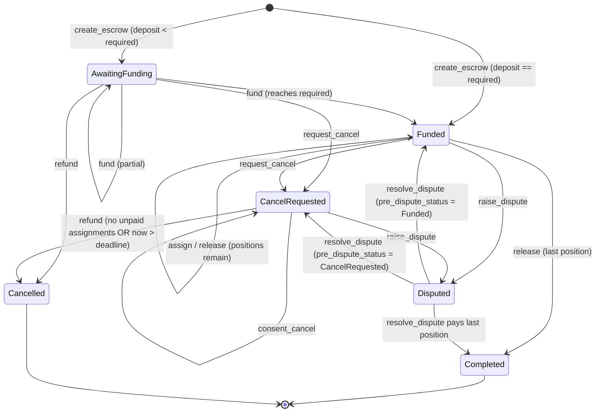

# BountyFlow Soroban contracts

`bounty_escrow` is the on-chain escrow behind BountyFlow. A requester locks
`reward_per_position * positions` of a token, assigns contributors to
positions, and releases one fixed reward per position. Cancellation needs the
consent of every assigned contributor who has not been paid, or the deadline
to have passed. A per-escrow arbiter settles disputes, and the only thing an
arbiter can do is pay an assigned contributor or remove that contributor's
assignment.

- SDK: `soroban-sdk` 28.0.0 (Rust 1.96, target `wasm32v1-none`)
- Stellar CLI: 27.0.0
- Contract interface version: `version() == 1`

## Deployed (Stellar Testnet)

> **Redeployed with the security-review fixes (2026-09-26).** The current deployment below includes SEC-05,
> SEC-06 and SEC-12 (see [Security review changes](#security-review-changes-redeployment-required)).
> The previous contract `CCJ52FHV…LMXK` (wasm `60dc9106…d2a5`) is superseded. It is recorded under
> `superseded_deployments` in `deployments/testnet.json` and must not be used.

| Item | Value |
|---|---|
| Contract id | `CDX6FN2MIGLHCMUJOU6C7FYP3QTNDL6BVIPEG4B5HAUEPU7NI4SFY4CY` ([explorer](https://stellar.expert/explorer/testnet/contract/CDX6FN2MIGLHCMUJOU6C7FYP3QTNDL6BVIPEG4B5HAUEPU7NI4SFY4CY)) |
| Native XLM SAC id | `CDLZFC3SYJYDZT7K67VZ75HPJVIEUVNIXF47ZG2FB2RMQQVU2HHGCYSC` |
| Arbiter (`bountyflow-arbiter`) | `GDKMJJGPM7ZFTDG6Y74O6JA2QCMQBEJJE7Q7I5FGKI77Z67XXY2C3LU2` |
| Deployer (`bountyflow-deployer`) | `GD646RGJJOHCMJDICTLPTPZXYQSS2Y4IZBOWEAYU2AU7PAT7ESKZKPE5` |
| Wasm hash | `a8ed0b13d5902f2bb17327337e7476c5ce484fd6d434434fbb82349ad9a12966` |

[`deployments/testnet.json`](deployments/testnet.json) is the machine-readable
record. It also holds the smoke-test transactions: `create_escrow` with a
1 XLM deposit, then `get_escrow`, then `release`, which moves the escrow to
`Completed`.

## Layout

```
contracts/
  Cargo.toml                 workspace + Soroban release profile
  Cargo.lock
  bounty_escrow/
    Makefile                 build / test / fmt / clippy / optimize
    src/lib.rs               contract + public API
    src/storage.rs           DataKey, escrow/assignment IO, TTL policy
    src/types.rs             Escrow, EscrowStatus, AssignmentState
    src/errors.rs            Error codes
    src/events.rs            #[contractevent] structs
    src/test.rs              unit tests (36)
  deployments/testnet.json   written by scripts/deploy-contract.{sh,ps1}
```

## Public interface

`bounty_id` is a `BytesN<32>`. The CLI and JSON take it as 64 hex characters.
Amounts are `i128` in the token's smallest unit. For XLM that is stroops, and
1 XLM = 10,000,000. Every state-changing function returns
`Result<Escrow, Error>` holding the updated escrow.

| Function | Auth | Allowed from status | Effect |
|---|---|---|---|
| `create_escrow(requester, bounty_id, token, reward_per_position, positions, arbiter, deadline, initial_deposit)` | requester | (new id) | Creates the escrow. `required = reward * positions`. Transfers `initial_deposit` from the requester if it is > 0. Status is `Funded` when fully funded, otherwise `AwaitingFunding`. |
| `fund(requester, bounty_id, amount)` | requester | AwaitingFunding | Transfers `amount` in. Status becomes `Funded` when `funded == required`. |
| `assign(requester, bounty_id, contributor)` | requester | Funded, and `now < deadline` | Reserves a position (`Assigned`). `assigned_unpaid += 1`. |
| `release(requester, bounty_id, contributor)` | requester | Funded | Pays one reward to the contributor, who can be pre-assigned or, if a position is free, paid directly. Marks them `Paid`. Status becomes `Completed` when all positions are paid. |
| `request_cancel(requester, bounty_id)` | requester | AwaitingFunding, Funded | Status becomes `CancelRequested`. |
| `consent_cancel(contributor, bounty_id)` | contributor | CancelRequested | The assigned contributor gives up their position (the assignment is removed). |
| `refund(requester, bounty_id)` | requester | AwaitingFunding, CancelRequested | Needs `assigned_unpaid == 0` **or** `now > deadline`. Returns `funded - paid_out - refunded` to the requester. Status becomes `Cancelled`. |
| `raise_dispute(caller, bounty_id)` | caller (the requester or an `Assigned` contributor) | Funded, CancelRequested, and `assigned_unpaid > 0` | Saves the current status in `pre_dispute_status`. Status becomes `Disputed`. |
| `resolve_dispute(arbiter, bounty_id, contributor, pay_contributor)` | the escrow's arbiter | Disputed | The contributor must be `Assigned`. With `pay_contributor = true`, pays them one reward and marks them `Paid`. With `false`, removes the assignment. Status then becomes `Completed` if all positions are paid, otherwise it returns to `pre_dispute_status`. |
| `get_escrow(bounty_id) -> Result<Escrow, Error>` | none | any | Read-only. |
| `assignment(bounty_id, contributor) -> Option<AssignmentState>` | none | any | Read-only. `None` means not assigned. |
| `version() -> u32` | none | any | Returns `1`. |

### Types

```rust
enum EscrowStatus { AwaitingFunding = 0, Funded = 1, CancelRequested = 2, Disputed = 3, Completed = 4, Cancelled = 5 }
enum AssignmentState { Assigned = 0, Paid = 1 }   // u32-repr contracttype enum

struct Escrow {
  requester: Address, token: Address, arbiter: Address,
  reward_per_position: i128, positions: u32, required_amount: i128,
  funded_amount: i128, paid_out_amount: i128, refunded_amount: i128,
  payouts_made: u32, assigned_unpaid: u32, deadline: u64,
  status: EscrowStatus, pre_dispute_status: EscrowStatus, created_at: u64,
}
```

Both enums are integer enums, so they serialize as `u32` (for example
`"status": 1` in CLI JSON). `i128` values show up as decimal strings in CLI
JSON.

### Validation rules (create_escrow)

| Check | Error |
|---|---|
| `bounty_id` already used | `AlreadyExists` |
| `reward_per_position <= 0` | `InvalidAmount` |
| `positions == 0 \|\| positions > 100` | `InvalidPositions` |
| `arbiter == requester` | `InvalidArbiter` |
| `deadline <= ledger.timestamp()` | `DeadlineInPast` |
| `reward * positions` overflows i128 | `Overflow` |
| `initial_deposit < 0` | `InvalidAmount` |
| `initial_deposit > required` | `Overfunded` |

The other functions work like this:

- A function that names a `requester` checks that it equals `escrow.requester` and returns `Unauthorized` if not.
- `assign` returns `DeadlineInPast` once `ledger.timestamp() >= deadline`, `Unauthorized` if `contributor == requester`, `AlreadyAssigned` if the contributor is already assigned or paid, and `PositionsExhausted` if `payouts_made + assigned_unpaid >= positions`.
- `raise_dispute` returns `NotAssigned` when no contributor is assigned-but-unpaid (the arbiter could never resolve such a dispute).
- `release` returns `AlreadyPaid` for a contributor who has already been paid.
- `release` of an unassigned contributor needs a free position. Otherwise it returns `PositionsExhausted`.
- A payout needs `funded - paid_out >= reward`. Otherwise it returns `InsufficientFunds`.
- All arithmetic is checked (`Overflow`). The release profile also keeps `overflow-checks = true`.

## State machine



While an escrow is `Disputed`, the functions `release`, `assign`, `fund`,
`request_cancel` and `refund` all fail with `InvalidState`. `Completed` and
`Cancelled` are terminal.

## Storage schema

All escrow data lives in **persistent** storage:

| Key | Value |
|---|---|
| `DataKey::Escrow(BytesN<32>)` | `Escrow` |
| `DataKey::Assignment(BytesN<32>, Address)` | `AssignmentState` (a missing key means not assigned; `consent_cancel` and an unassigning `resolve_dispute` delete the key) |

Nothing else is stored. There is no admin key and no global config. The
contract version is a compile-time constant.

**TTL policy** (`src/storage.rs`):

- `BUMP_THRESHOLD` is 15 days (259,200 ledgers) and `BUMP_TO` is 30 days (518,400 ledgers), at about 5 s per ledger.
- Every write, and every read made inside a state-changing call, extends the entry to `BUMP_TO` once its remaining TTL falls below `BUMP_THRESHOLD`. The contract instance is extended the same way on every state-changing call.
- Read-only views (`get_escrow`, `assignment`) do not extend TTL, because they normally run as simulations.
- An escrow that sits idle for more than about 30 days can be extended by anyone with `stellar contract extend`, or restored with `stellar contract restore` if it was archived. Persistent entries are archived, not deleted, so funds are never lost to expiry.

## Events

Every event is a `#[contractevent]`. Topics are `[<snake_case event name>, bounty_id]`.
The data is a map of the remaining fields.

| Event (topic 0) | Data fields | Emitted by |
|---|---|---|
| `escrow_created` | `requester, token, required_amount, arbiter` | create_escrow |
| `escrow_funded` | `amount, funded_total` | create_escrow (if deposit > 0), fund |
| `contributor_assigned` | `contributor` | assign |
| `reward_released` | `contributor, amount` | release, and resolve_dispute when it pays |
| `cancel_requested` | (none) | request_cancel |
| `cancel_consented` | `contributor` | consent_cancel |
| `escrow_refunded` | `amount` | refund |
| `dispute_raised` | `raised_by` | raise_dispute |
| `dispute_resolved` | `contributor, paid` | resolve_dispute |

The token contract also emits its own SEP-41 / SAC `transfer` events.

## Error codes

| Code | Name | Code | Name |
|---|---|---|---|
| 1 | NotFound | 9 | NotAssigned |
| 2 | AlreadyExists | 10 | PositionsExhausted |
| 3 | InvalidAmount | 11 | InsufficientFunds |
| 4 | InvalidPositions | 12 | Overfunded |
| 5 | InvalidState | 13 | DeadlineInPast |
| 6 | Unauthorized | 14 | AssignmentsOutstanding |
| 7 | AlreadyPaid | 15 | Overflow |
| 8 | AlreadyAssigned | 16 | InvalidArbiter |

On-chain these appear as `Error(Contract, #N)`.

## Tokens and native XLM

The contract moves funds only through `soroban_sdk::token::Client::transfer`,
so it works with any SEP-41 token. In practice that means Stellar Asset
Contracts (SAC).

Native XLM has a built-in SAC. To escrow XLM, pass the native SAC contract id
as `token`:

```bash
stellar contract id asset --asset native --network testnet
# CDLZFC3SYJYDZT7K67VZ75HPJVIEUVNIXF47ZG2FB2RMQQVU2HHGCYSC
```

Deposits call `transfer(requester -> contract)`, so the requester's
`require_auth` tree has to include that sub-invocation. Simulation records it
automatically. Payouts and refunds call `transfer(contract -> recipient)`,
which the contract authorizes itself.

## Security review changes (redeployment required)

Made during the 2026-09-26 security review (`docs/security.md`, findings
SEC-05, SEC-06, SEC-12). Error codes are unchanged; no new storage.

| ID | Change | Why |
|---|---|---|
| SEC-05 | `raise_dispute` requires `assigned_unpaid > 0` (else `NotAssigned`). | `Disputed` can only be left through `resolve_dispute` for an `Assigned` contributor. A requester who disputed an escrow with no assigned contributor froze it **forever**: no function could ever move the remaining funds again. |
| SEC-06 | `assign` requires `ledger.timestamp() < deadline` (else `DeadlineInPast`). | After the deadline `refund` ignores assignments, so a late assignment protected nothing while looking like protection to the contributor. |
| SEC-12 | Payouts follow checks-effects-interactions: `release` / `resolve_dispute` persist the escrow before `token.transfer`. | Defence in depth. Soroban already forbids contract re-entry, but `token` is chosen by the requester, so the escrow no longer relies on that. |

Tests: `dispute_requires_an_assigned_contributor`,
`assign_rejected_at_or_after_deadline`, `payouts_record_state_and_move_funds_once`
(and `dispute_raise_state_rules` now assigns a contributor first). Until the
new wasm is deployed, the backend refuses to prepare an on-chain dispute
unless the disputed contributor is assigned on-chain, and refuses on-chain
assignments after the escrow deadline.

## Trust assumptions and limitations

- **The contract is permissionless and accepts any token, arbiter and
  deadline.** Anyone can call `create_escrow` at any `bounty_id`. The contract
  cannot know which escrow "belongs" to a BountyFlow bounty, so the backend
  only trusts an on-chain escrow whose immutable terms (requester, token,
  arbiter, reward, positions, deadline, id) equal a `create_escrow` it prepared
  itself, and new escrow ids are random rather than derived from the public
  bounty UUID (SEC-01, SEC-02 in `docs/security.md`). Integrators other than
  BountyFlow must do the same checks.
- **Arbiter liveness.** A `Disputed` escrow only moves when the arbiter signs
  `resolve_dispute`. If the arbiter key is lost, disputed escrows stay frozen.
  Keep the arbiter key in a hardware wallet or multisig account.
- **No admin, no upgrade.** The contract has no `__constructor`, no admin key,
  and no `update_current_contract_wasm` call. Once deployed, its code cannot
  change. A fix means deploying a new contract.
- **Bounded arbiter power.** The arbiter is chosen per escrow at creation and
  must differ from the requester. The arbiter can act only while an escrow is
  `Disputed`. Even then, the arbiter can only pay one reward to a contributor
  who is currently `Assigned`, or remove that contributor's assignment. No
  function sends funds to an arbitrary address. Leftover funds can only return
  to the requester, through `refund`.
- **Requester refunds are gated.** The requester can refund only from
  `AwaitingFunding` (assignments are impossible before full funding) or from
  `CancelRequested`, and only when no contributor is assigned-but-unpaid or
  the deadline has passed. After the deadline the requester can refund even
  with outstanding assignments. Contributors should raise a dispute before the
  deadline if they have delivered work. A `Disputed` escrow cannot be refunded.
- **The requester controls payouts.** `release` is at the requester's
  discretion. A contributor protects their work by getting assigned, which
  reserves a position and blocks a refund until the deadline, and by raising
  a dispute.
- **Per-position rewards.** Each position pays exactly `reward_per_position`.
  One address can be paid at most once per bounty.
- **Partial funding.** An escrow can be funded in several steps, but
  assignment and release need full funding (`Funded`).
- **Up to 100 positions** per bounty.
- **Deadline** uses the ledger timestamp (seconds). It must be in the future
  at creation.
- **Only SAC or SEP-41 tokens** are supported. Tokens with fees on transfer
  or rebasing balances are not supported, because the contract assumes it
  receives exactly the amount it transferred.

## Build, test, deploy

```bash
cd contracts
cargo test                       # 36 unit tests
cargo clippy --all-targets -- -D warnings
cargo fmt --all --check
stellar contract build           # optimized wasm (optimization on by default in CLI 27)
# fallback: cargo build --target wasm32v1-none --release
# output: contracts/target/wasm32v1-none/release/bounty_escrow.wasm (~16.7 KB)

# or, from contracts/bounty_escrow:
make test | make build | make clippy | make fmt | make optimize
```

Deploy to Testnet from the repository root:

```bash
scripts/deploy-contract.sh                     # bash (Linux/macOS/Git Bash)
RUN_SMOKE_TEST=1 scripts/deploy-contract.sh    # + create_escrow/get_escrow/release smoke flow
powershell -ExecutionPolicy Bypass -File scripts/deploy-contract.ps1 [-SmokeTest]
```

The scripts do the following:

1. Build the wasm.
2. Create and friendbot-fund the identities `bountyflow-deployer` (override
   with `STELLAR_SOURCE_ACCOUNT`) and `bountyflow-arbiter` (override with
   `ARBITER_IDENTITY`).
3. Upload the wasm and deploy the contract.
4. Look up the native XLM SAC id.
5. Call `version()`.
6. Write `contracts/deployments/testnet.json`.

Secret keys stay in the local Stellar CLI key store (`~/.config/stellar`) and
are never written to the repo. Each run deploys a **new** contract instance,
because the contract is immutable.

Example invocations:

```bash
ID=CDX6FN2MIGLHCMUJOU6C7FYP3QTNDL6BVIPEG4B5HAUEPU7NI4SFY4CY
XLM=CDLZFC3SYJYDZT7K67VZ75HPJVIEUVNIXF47ZG2FB2RMQQVU2HHGCYSC
stellar contract invoke --id $ID --source-account bountyflow-deployer --network testnet -- version
stellar contract invoke --id $ID --source-account <requester> --network testnet -- \
  create_escrow --requester <G...> --bounty_id <64 hex> --token $XLM \
  --reward_per_position 10000000 --positions 1 --arbiter GDKMJJGPM7ZFTDG6Y74O6JA2QCMQBEJJE7Q7I5FGKI77Z67XXY2C3LU2 \
  --deadline <unix secs> --initial_deposit 10000000
stellar contract invoke --id $ID --source-account <any> --network testnet -- get_escrow --bounty_id <64 hex>
```
