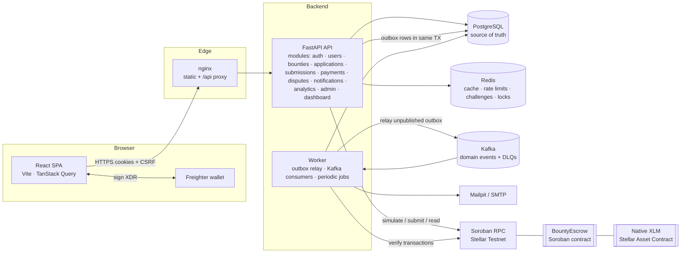
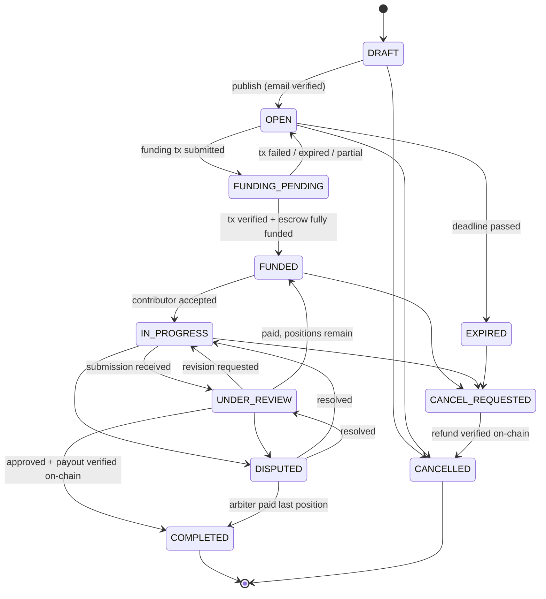
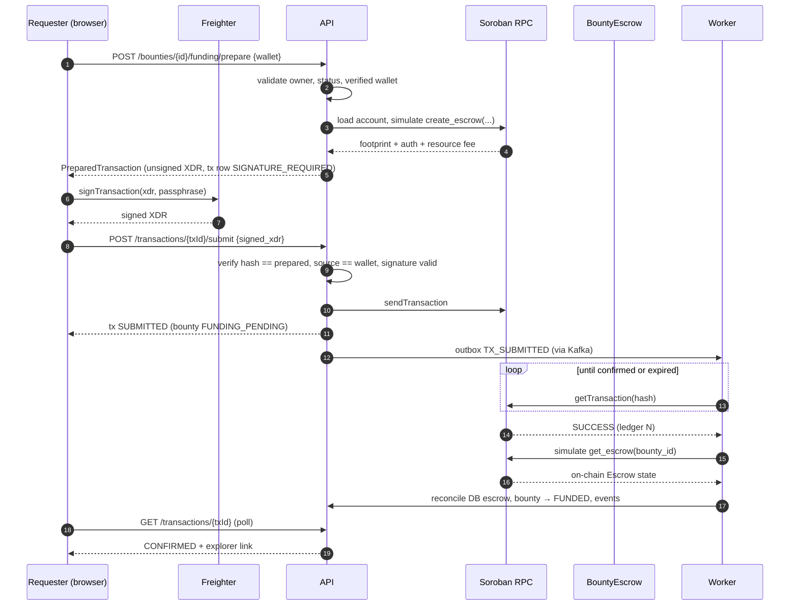
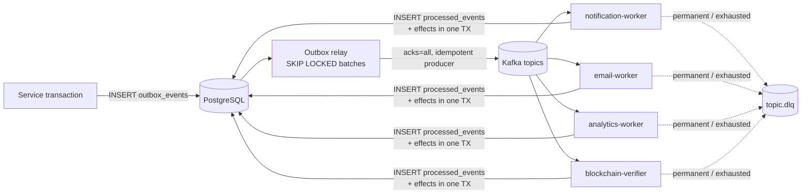

# Architecture

BountyFlow is a **modular monolith** with dedicated background workers. A single FastAPI service owns the HTTP API
and domain logic. A worker process runs Kafka consumers, the outbox relay and scheduled jobs. PostgreSQL is the
source of truth. Stellar Soroban holds the funds.

## System overview

## Request lifecycle

1. `RequestContextMiddleware` assigns `X-Request-ID` and a correlation ID and binds them to the logging context
   (Logifyx structured logs). `BodySizeLimitMiddleware` rejects oversized bodies. CORS uses an allowlist.
   `SecurityHeadersMiddleware` adds CSP, `nosniff` and related headers. `CSRFMiddleware` enforces the
   double-submit token on every mutating `/api/v1` route.
2. Dependencies resolve the user from the `bf_access` JWT cookie and check that the session row is still valid.
   RBAC guards (`require_permission`, see [security.md](security.md)) run next.
3. A router calls a **service** that validates the domain rules. The service locks rows in a fixed order (bounty
   first), mutates state through the **state machine**, writes an **audit log** entry and stages **outbox events**,
   then commits once.
4. After commit, caches are invalidated. The public marketplace uses a generation counter, so a single `INCR`
   invalidates every cached query.

## Module layout (backend)

| Layer | Location | Responsibility |
|---|---|---|
| HTTP | `app/modules/*/router.py`, `app/api/*` | Validation, auth, typed responses |
| Domain | `app/modules/*/service.py`, `bounties/state_machine.py` | Business rules, transitions, events |
| Data | `app/modules/*/models.py`, `repository.py`, `migrations/` | SQLAlchemy 2.1 models, queries, Alembic |
| Chain | `app/blockchain/*` | Network config, SEP-10 wallet proof, adapters, verification, reconciliation |
| Messaging | `app/messaging/*`, `worker/*` | Event envelope, schemas, outbox, consumers, DLQ |
| Cross-cutting | `app/core/*`, `app/cache/*` | Config, security, RBAC, logging, rate limits, cache keys |

## Bounty lifecycle

All transitions are defined centrally in `app/modules/bounties/state_machine.py`. Clients never set a status
directly. `FUNDED`, `IN_PROGRESS` and `UNDER_REVIEW` are *derived* from live work
(`recompute_operational_status`). An approved-but-unpaid submission keeps the bounty `UNDER_REVIEW` until the
payout is verified.

## Funding and payout sequence

Payouts, refunds, assignment locks and dispute resolutions use the same pipeline with a different contract
function (`release`, `refund`, `assign`, `resolve_dispute`, …). A payout is marked `CONFIRMED` only after
`assignment(bounty_id, contributor)` reads back as `Paid` from the contract.

## Event processing

See [kafka-events.md](kafka-events.md) for topics, envelopes and reliability guarantees.

## Key decisions

| Decision | Rationale |
|---|---|
| Modular monolith + worker | Clear domain boundaries without distributed-transaction complexity. |
| Transactional outbox | State and its events commit atomically; Kafka outages delay events but never lose them. |
| Backend builds, wallet signs | The server enforces domain rules and simulates contract calls. The wallet signs the exact prepared transaction, and the server checks the hash before submitting. Private keys never touch BountyFlow. |
| Verify from chain state | Funding and payouts are recorded from contract reads after confirmation, never from client claims. |
| Cookie auth + CSRF | HttpOnly tokens are not readable by XSS. Double-submit CSRF protects every mutation. |
| Redis only for ephemeral state | Caches, rate limits, challenges and locks. Losing Redis never corrupts financial data. |
| Real network only | The application has no simulated chain. Automated tests inject a test double that still exercises real XDR and signature verification; Playwright runs on Stellar Testnet. |
