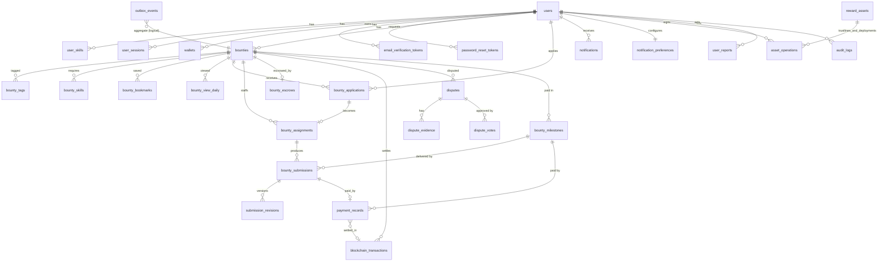

# Database

PostgreSQL 17 is the source of truth. The schema is managed with **Alembic**
(`backend/migrations/versions`). The API never calls `create_all` outside tests.

```bash
make migrate                         # alembic upgrade head
make migration m="add something"     # autogenerate a new revision (review it!)
make reset-db                        # DESTRUCTIVE, asks for confirmation
```

`RUN_MIGRATIONS_ON_STARTUP=true` makes the API apply migrations on boot. The step runs under a Postgres advisory
lock, so concurrent replicas are safe.

## Conventions

- UUID primary keys and timezone-aware timestamps (`timestamptz`).
- Money is stored as `NUMERIC(20,7)`, matching Stellar's 7 decimal places. Floats are never used. On-chain values
  are integer stroops.
- Enums are stored as `VARCHAR` with named `CHECK` constraints, which are cheap to migrate compared with native
  PG enums.
- Naming conventions are set for every index and constraint (`app/db/base.py`).
- Transaction and audit rows are never deleted. Failures keep their `failure_reason`.

## Entity relationships



## Tables

| Table | Purpose | Notable constraints / indexes |
|---|---|---|
| `users` | Identity and profile | unique `normalized_email`, unique `username` |
| `user_skills` | Profile skills | unique (user, skill) |
| `user_sessions` | Refresh-token sessions | unique `refresh_token_hash`; `previous_token_hash` for reuse detection |
| `email_verification_tokens`, `password_reset_tokens` | Single-use tokens (SHA-256 hashed) | unique `token_hash`; `used_at`, `expires_at` |
| `wallets` | Verified Stellar addresses (`G…` accounts and `C…` smart wallets) | **partial unique** (address, network) where VERIFIED; `wallet_app` + `proof_method` (sep10 / sep53 / sep45) record what verified it; `is_primary` picks the payout wallet |
| `passkey_wallets` | Soroban smart wallets whose signer is a WebAuthn passkey | unique (network, contract_id), unique (network, key_id); `status` DEPLOYING → ACTIVE only after the deployment is confirmed **and** the code reads back as the expected `wasm_hash` |
| `sponsored_transactions` | Every transaction whose fee the platform sponsor paid or bid to pay | unique (network, envelope_hash) makes recording idempotent; index (user_id, created_at) for the daily caps, (created_at) and (passkey_wallet_id) for the admin views |
| `bounties` | Bounty listings; `reward_asset_identifier` (indexed) is the reward asset, `reward_asset` its code for display; `require_merged_pr` gates approval on a verified merged pull request | CHECKs: reward > 0, positions 1–100, deadline order; generated **`tsvector`** column + GIN index; `version_id` optimistic locking |
| `bounty_tags`, `bounty_skills` | Tags and required skills | unique per bounty |
| `bounty_bookmarks` | Saved bounties | unique (user, bounty) |
| `bounty_view_daily` | Popularity input (views per day) | PK (bounty, day) |
| `bounty_applications` | Applications | **partial unique** (bounty, contributor) where PENDING/ACCEPTED |
| `bounty_assignments` | Selected contributors | **partial unique** (bounty, contributor) where ACTIVE/COMPLETED; `onchain_assigned` |
| `bounty_submissions` + `submission_revisions` | Work and its immutable version history | unique (submission, version); v2: `milestone_id`, `onchain_state` (review clock mirror), `onchain_submitted_at`, `claimable_at`, `claim_notified_at`, partial index `ix_bounty_submissions_claimable` for the review-clock job |
| `bounty_escrows` | DB view of on-chain escrow, reconciled from chain | CHECK `paid_out + refunded <= funded`; unique `onchain_bounty_id`; `contract_id` + `contract_version` (the contract the escrow lives on), `arbiter_addresses`, `arbiter_threshold`, `review_window_seconds`, `dispute_round`, `clock_reset_at` |
| `bounty_milestones` | Escrow v2: the milestones of a single-position bounty | unique (bounty, position); `status` OPEN / PAID / SETTLED set only from verified chain state; `payout_transaction_id` |
| `blockchain_transactions` | Every prepared/submitted/confirmed/failed tx | **unique (network, transaction_hash)** |
| `payment_records` | Payouts per approved submission | unique `submission_id`; **partial unique** (bounty, contributor) where `milestone_id` IS NULL; unique `milestone_id` |
| `completion_attestations` | One per completed (bounty, contributor) pair: what the on-chain attestation registry records | unique (bounty, contributor) — a batch payout makes several rows from one hash; unique (network, contract_id, onchain_id); CHECKs amount > 0 and payments_count > 0; indexes (contributor, status), (status, next_attempt_at) for the pipeline job and (status, chain_checked_at) for reconciliation. `amount` is the SQL sum of that contributor's confirmed payments on the bounty, in `asset_identifier` |
| `verifiable_credentials` | Issued W3C credentials (the signed document as issued) | unique `status_index` (its bit in the public status list); **partial unique** `attestation_id` where kind = COMPLETION and not revoked; partial index (issuer_did, status_index) where revoked, which builds the status list |
| `disputes` + `dispute_evidence` | Dispute workflow | **partial unique** one open dispute per bounty; `contributor_amount` for a SPLIT |
| `dispute_votes` | Escrow v2: verified arbiter approvals, one per arbiter and dispute round | unique (dispute, arbiter_address, round), written with an upsert |
| `notifications` | In-app notifications | unique (user, source_event_id) makes them idempotent |
| `notification_preferences` | Per-type in-app/email settings | PK user |
| `email_deliveries` | Email log | unique `idempotency_key` gives exactly-once sending |
| `bounty_qa_posts` | Bounty questions and their replies (`parent_id` NULL = a question); soft-deleted and moderator-hideable | **partial unique** (`parent_id`) where `is_accepted` — one accepted answer per question; CHECKs: only questions pin, only replies are accepted, `upvotes_count >= 0`; index (bounty, parent, created_at) for a thread page and a **partial** index on `bounty_id` where the post is a visible question, which serves the count on cards and detail |
| `bounty_qa_votes` | One upvote per user per post ("most helpful" sort) | PK (post, user); index (user_id). The counter on the post is moved in SQL in the same transaction |
| `github_accounts` | A GitHub account a user proved they own | PK `user_id`, **unique `github_id`** — one GitHub account per BountyFlow account; `method` (GIST / OAUTH) and `proof_url` record how it was verified |
| `submission_pull_requests` | Pull requests linked to a submission, with the latest verification snapshot | unique (submission, owner, repo, number); indexes (submission_id), (owner, repo, number) and (head_sha) for webhook lookups, and (next_check_at) for the re-check job. `snapshot` (JSONB) holds the check runs and statuses as GitHub reported them |
| `user_reports` | Moderation reports | index (target_type, target_id); `target_type` includes `QA_POST` |
| `feedback` | Notes sent from the floating feedback form, and their triage state | `user_id` and `handled_by_id` are ON DELETE SET NULL, so a closed account's note stays readable without its author; CHECKs list the allowed `kind` and `status`; indexes (created_at), (status, created_at) and (kind, created_at) — the queue is always newest first, unfiltered or filtered by one of the two. No IP address is stored |
| `audit_logs` | Append-only state transitions | index (bounty, created_at), (entity, created_at) |
| `outbox_events` | Transactional outbox | partial index on unpublished rows |
| `processed_events` | Consumer idempotency | PK (consumer, event_id) |
| `daily_metrics` | Aggregated analytics | PK (day, metric), recomputed idempotently. Per-asset payout volume uses `payout_volume:CODE:ISSUER` (plain `payout_volume` is XLM) |
| `reward_assets` | The assets bounties may be paid in, per network | unique (network, identifier) and (network, contract_id); index (network, is_enabled). `contract_id` is the asset's derived Stellar Asset Contract; entries are disabled, never deleted |
| `asset_operations` | Wallet-signed trustlines and asset-contract deployments | unique (network, transaction_hash); index (user, created_at) and (status). `submitted_xdr` keeps the exact envelope sent, so a retry never makes a second transaction; `sponsorship_id` links the sponsored fee |
| `saved_searches` | A marketplace query a user follows: `filters` (JSONB, every marketplace filter plus a rolling `deadline_within_days`), its alert frequency and channels | index (user_id); index (alert_frequency, next_digest_at) finds the digests that are due; `last_viewed_at` drives "N new since you last looked" |
| `saved_search_matches` | One row per (saved search, bounty) that matched | **PK (saved_search_id, bounty_id)** is the deduplication — a bounty alerts a search once however many events it causes; index (saved_search_id, matched_at) for the new-since counter and a **partial** index on the same columns where `delivery = 'PENDING'` for the digest job |
| `skill_nodes`, `skill_edges` | The skill co-occurrence graph, rebuilt on a schedule | PK `skill` / PK (skill, related); edges are stored in both directions, so neighbours are one indexed read. `bounty_forms` keeps the raw spellings so a normalised skill can link to the marketplace's exact-name filter |
| `data_exports` | A requested copy of a user's data; the gzip-compressed JSON archive lives here until it expires | index (user, created_at) and on `status`; `expires_at` clears `archive` |
| `account_deletion_requests` | Deletion requests and their grace period | **partial unique** (user) where `SCHEDULED`; index (status, scheduled_for) for the worker |
| `screening_entries` | Stellar addresses that may not be used, from the sanctions list or added by an admin | **partial unique** (address, source) where not removed; removed entries are kept for the record |
| `legal_document_versions` | Published versions of the terms and privacy notice | unique (document, version); index (document, effective_at) |
| `legal_acceptances` | Who accepted which version, append-only | unique (user, version) |

Recommendations match bounties on the **normalised** skill name ("JS" and "javascript" are one key), which the
plain indexes on `bounty_skills.skill_name`, `bounty_tags.tag` and `user_skills.skill_name` cannot serve, so
migration `0009` adds an expression index per column on
`regexp_replace(lower(btrim(<column>)), '[\s_-]+', ' ', 'g')`.

## Concurrency

- State changes lock the **bounty row first** (`SELECT … FOR UPDATE`), then the child row. The fixed order
  prevents deadlocks, for example when two applications on one bounty are accepted concurrently.
- `bounties.version_id` adds optimistic concurrency. A `StaleDataError` is surfaced as `409 Conflict`.
- Money-moving steps (fund, milestone release, batch payout, claim, refund, dispute execution) write all their rows
  (domain rows, audit log, outbox events) in one database transaction. No row lock is held across chain I/O: the
  prepare step commits the intent, the wallet signs and submits, and verification reads the chain first, then locks
  and records the verified result in a new transaction. A batch payout locks the bounty, then every submission and
  payment of the batch in id order, and confirms all legs or none.
- Verification is idempotent: payments are created with `INSERT … ON CONFLICT DO NOTHING` on their unique keys and
  arbiter votes are upserted, so a verification that runs twice records the outcome once.
- Fee sponsorship follows the same shape. The daily caps are read and the `sponsored_transactions` row is inserted
  in one transaction, under a per-user advisory lock (`pg_advisory_xact_lock`), so two concurrent submissions
  cannot both pass the cap. Relaying a smart-wallet transaction needs the fee from a simulation, so the read
  transaction is committed first, the chain is called with no lock held, and the caps are re-checked with the real
  fee in the transaction that records the row. Choosing the payout wallet locks the user's wallet rows by id
  before demoting and promoting, so two concurrent choices cannot leave two primary wallets.
- Unique and partial-unique indexes are the final guard against duplicate applications, assignments, payouts and
  wallets.
- Saved-search matching fans out over many searches for one published bounty, so it is decided in SQL: every
  search's clause becomes a branch of a `UNION ALL` that returns the `(search, bounty)` pairs that match, and the
  rows are written with one `INSERT … ON CONFLICT DO NOTHING`. The digest job locks the due searches
  (`FOR UPDATE … SKIP LOCKED`), re-checks every pending match with the same batched statement, and marks the
  outcome with two `UPDATE`s over `(saved_search_id, bounty_id)` tuples, all in one transaction.

## Search

`bounties.search_vector` is a stored generated `tsvector`, with the title weighted A, the short description B
and the description C. The marketplace uses `websearch_to_tsquery('english', q)` with `ts_rank_cd` for relevance,
plus an `ILIKE` fallback on the title.

Saved searches reuse the marketplace's own query builder rather than repeating its filters, so the two can never
drift apart. See [discovery.md](discovery.md).
