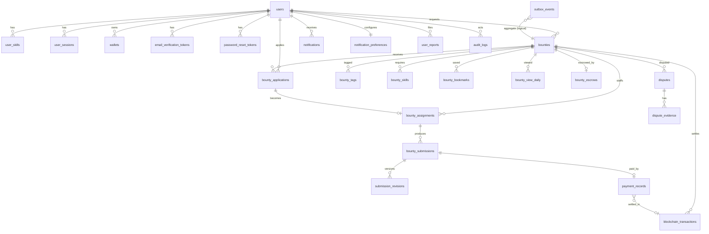

# Database

PostgreSQL 17 is the source of truth. The schema is managed with **Alembic**
(`backend/migrations/versions`). The API never calls `create_all` outside tests.

```bash
make migrate                         # alembic upgrade head
make migration m="add something"     # autogenerate a new revision (review it!)
make reset-db                        # DESTRUCTIVE, asks for confirmation
```

`RUN_MIGRATIONS_ON_STARTUP=true` makes the API apply migrations on boot. The step runs under a Postgres advisory
lock, so concurrent replicas are safe.

## Conventions

- UUID primary keys and timezone-aware timestamps (`timestamptz`).
- Money is stored as `NUMERIC(20,7)`, matching Stellar's 7 decimal places. Floats are never used. On-chain values
  are integer stroops.
- Enums are stored as `VARCHAR` with named `CHECK` constraints, which are cheap to migrate compared with native
  PG enums.
- Naming conventions are set for every index and constraint (`app/db/base.py`).
- Transaction and audit rows are never deleted. Failures keep their `failure_reason`.

## Entity relationships



## Tables

| Table | Purpose | Notable constraints / indexes |
|---|---|---|
| `users` | Identity and profile | unique `normalized_email`, unique `username` |
| `user_skills` | Profile skills | unique (user, skill) |
| `user_sessions` | Refresh-token sessions | unique `refresh_token_hash`; `previous_token_hash` for reuse detection |
| `email_verification_tokens`, `password_reset_tokens` | Single-use tokens (SHA-256 hashed) | unique `token_hash`; `used_at`, `expires_at` |
| `wallets` | Verified Stellar addresses | **partial unique** (address, network) where VERIFIED |
| `bounties` | Bounty listings | CHECKs: reward > 0, positions 1–100, deadline order; generated **`tsvector`** column + GIN index; `version_id` optimistic locking |
| `bounty_tags`, `bounty_skills` | Tags and required skills | unique per bounty |
| `bounty_bookmarks` | Saved bounties | unique (user, bounty) |
| `bounty_view_daily` | Popularity input (views per day) | PK (bounty, day) |
| `bounty_applications` | Applications | **partial unique** (bounty, contributor) where PENDING/ACCEPTED |
| `bounty_assignments` | Selected contributors | **partial unique** (bounty, contributor) where ACTIVE/COMPLETED; `onchain_assigned` |
| `bounty_submissions` + `submission_revisions` | Work and its immutable version history | unique (submission, version) |
| `bounty_escrows` | DB view of on-chain escrow, reconciled from chain | CHECK `paid_out + refunded <= funded`; unique `onchain_bounty_id` |
| `blockchain_transactions` | Every prepared/submitted/confirmed/failed tx | **unique (network, transaction_hash)** |
| `payment_records` | Payouts per approved submission | unique `submission_id`; unique (bounty, contributor) |
| `disputes` + `dispute_evidence` | Dispute workflow | **partial unique** one open dispute per bounty |
| `notifications` | In-app notifications | unique (user, source_event_id) makes them idempotent |
| `notification_preferences` | Per-type in-app/email settings | PK user |
| `email_deliveries` | Email log | unique `idempotency_key` gives exactly-once sending |
| `user_reports` | Moderation reports | index (target_type, target_id) |
| `audit_logs` | Append-only state transitions | index (bounty, created_at), (entity, created_at) |
| `outbox_events` | Transactional outbox | partial index on unpublished rows |
| `processed_events` | Consumer idempotency | PK (consumer, event_id) |
| `daily_metrics` | Aggregated analytics | PK (day, metric), recomputed idempotently |

## Concurrency

- State changes lock the **bounty row first** (`SELECT … FOR UPDATE`), then the child row. The fixed order
  prevents deadlocks, for example when two applications on one bounty are accepted concurrently.
- `bounties.version_id` adds optimistic concurrency. A `StaleDataError` is surfaced as `409 Conflict`.
- Unique and partial-unique indexes are the final guard against duplicate applications, assignments, payouts and
  wallets.

## Search

`bounties.search_vector` is a stored generated `tsvector`, with the title weighted A, the short description B
and the description C. The marketplace uses `websearch_to_tsquery('english', q)` with `ts_rank_cd` for relevance,
plus an `ILIKE` fallback on the title.
